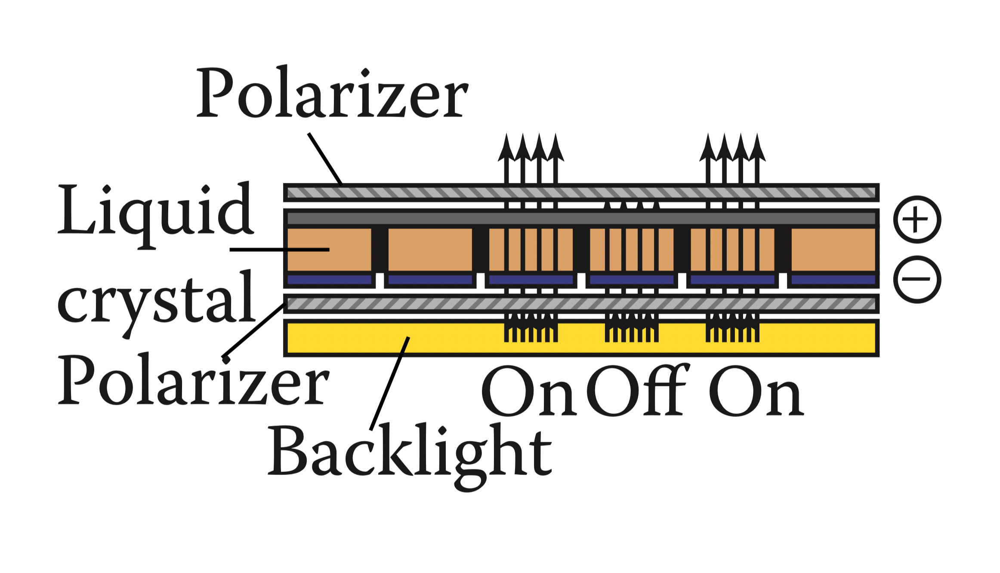
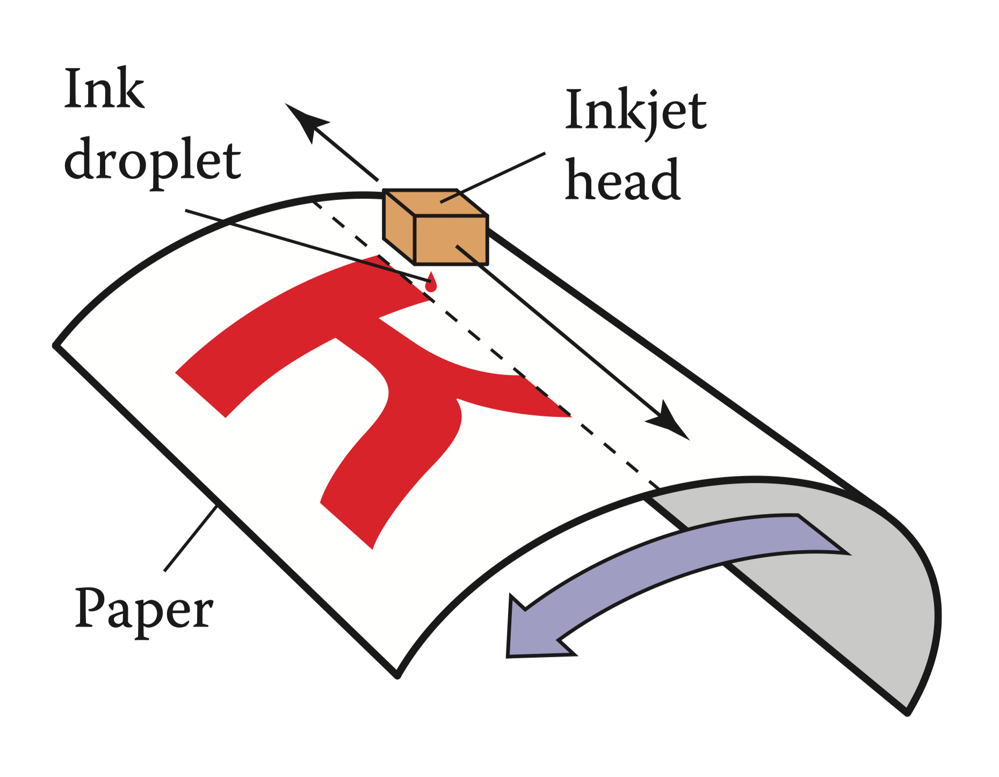
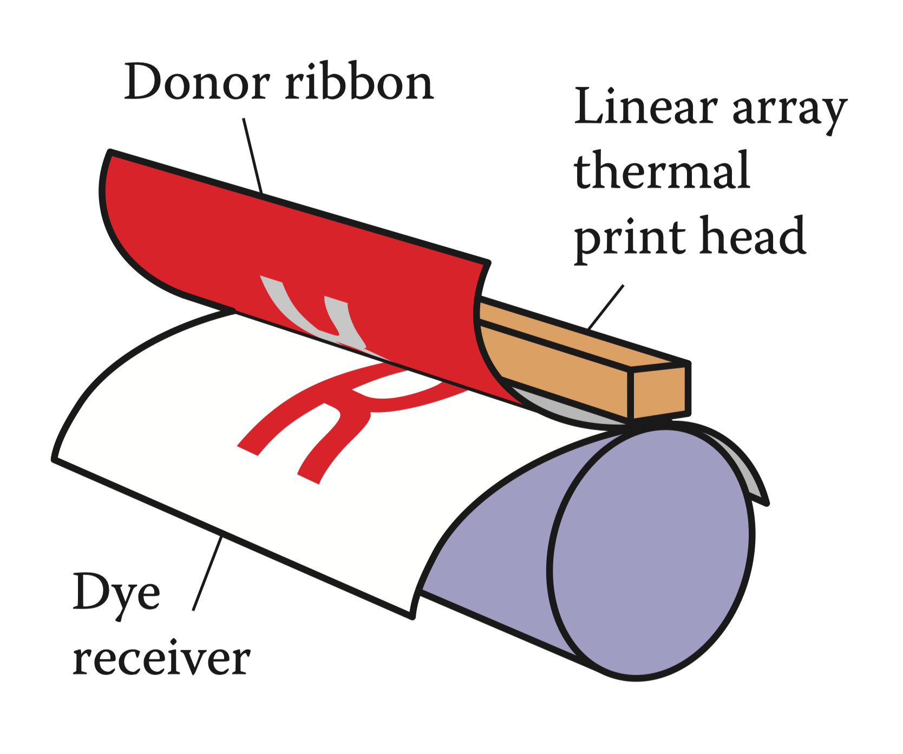
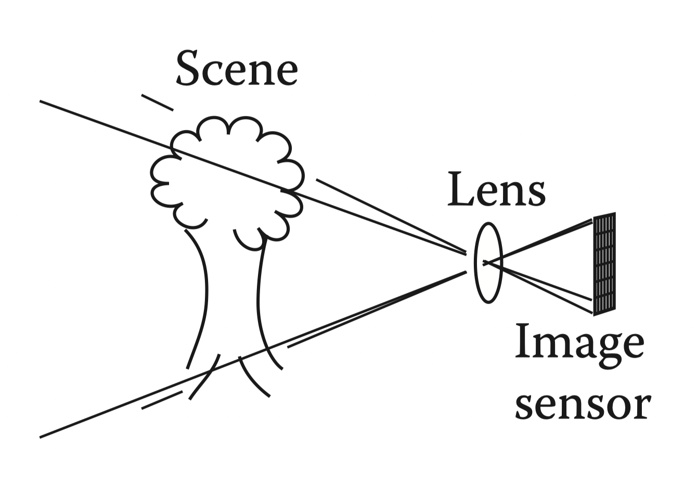
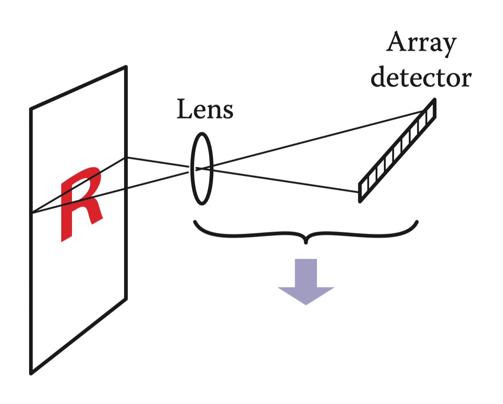
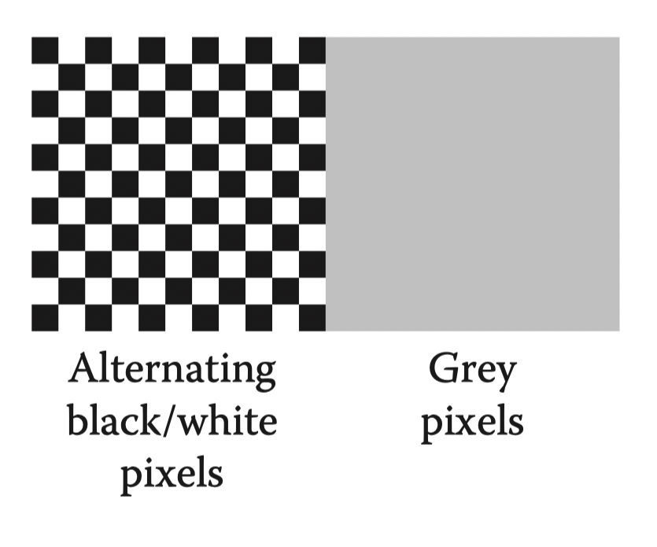
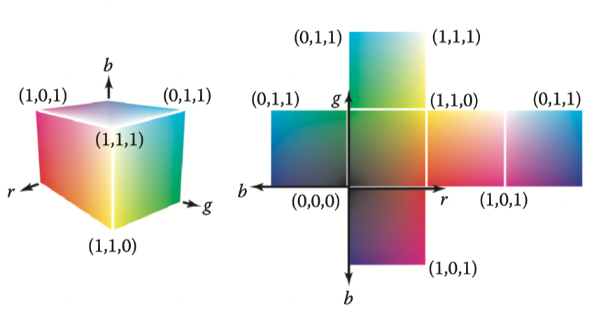

# 3 光栅图像

大部分计算机图形学图像都是在某种光栅显示器上被展示给用户。光栅显示器以像素的矩形阵列来展示图像。一个常见的例子是平板电脑显示器或电视，它们拥有小型发光像素的矩形阵列，并且能单独地被设置为不同的颜色来创建任何所需的图像。通过混合不同强度的红光，绿光和蓝光来实现不同的颜色。大部分打印机，例如激光打印机和喷墨打印机，也是光栅设备。它们是基于扫描的：不存在实际的像素网格，但是可以通过在网格中选定点沉淀墨水来顺序放置图像。

光栅在图像的输入设备中也很普遍。一个数码相机包含了一个由光敏像素网格组成的图像传感器，每个传感器记录了落在上面的光线的强度和颜色。一台桌面扫描仪包含了一个像素的线性数组，它在被扫描的页面上扫过，每秒进行多次测量以产生一个像素网格。

因为光栅在设备中如此普遍，所以光栅图像是存储和处理图像最常见的方式。光栅图像通常是一个存储每个像素的像素值 2D 数组，像素值通常是被存储为红，绿和蓝三个数字的颜色。通过使用存储在图像中的每个像素控制显示器上像素的颜色，可以显示存储在内存中的光栅图像。

但是我们并不总是想要以这种方式来展示图像。我们可能想要改变图像的尺寸或方法，纠正颜色，或甚至显示粘贴在移动的三维表面上的图像。即使在电视上，显示器也很少会拥有和被展示的图像相同的像素数。考虑到这些情况破坏了显示像素和图像像素之间的直接联系。最好将光栅图像视作一个与设备无关的图像来进行显示，并将显示设备作为一种趋近理想图像的方式。

除了使用像素数组之外，还有其他用于描述图片的方法。通过存储颜色的形状区域的描述来描述矢量图像，这些区域受到线段和曲线的约束，不涉及任何特定的像素网格。本质上这等同于存储如何显示图像的指令，而不是显示图像所需的像素。矢量图像最主要的优点是它们与分辨率无关，并且能在高分辨率的设备上很好地显示出来。相应的缺点是在显示它们之前必须将其光栅化。矢量图像通常用于文本，图表，机械图纸和其他应用程序，这些应用程序中清晰度和精度很重要但是不需要摄影图像和复杂的阴影。

在本章中，我们讨论光栅图像和显示器的基础知识，特别关注于标准显示器的非线性。当我们在后续的章节中讨论计算图像时，像素值和如何和光照强度相关的细节非常重要。

## 3.1 光栅设备

在抽象讨论光栅图像之前，了解使用这些图像的特定设备的基本操作是有益的。一些熟悉的光栅设备可以被划分为一个简单的结构：

- 输出
  - 显示器
    - 透射型：液晶显示器（LCD）
    - 发射型：发光二极管（LED）显示器
  - 硬拷贝
    - 二进制：喷墨打印机
    - 连续色调：热升华打印机
- 输入
  - 2D 感光阵列：数码相机
  - 1D 感光阵列：平板扫描仪

### 3.1.1 显示器

当前的显示器，包括电视和数字电影放映机以及用于计算机的显示器和投影仪，几乎都是基于固定的像素阵列的。它们被划分为透射型显示器和发射型显示器，其中发射型显示器通过直接发射可控数量的光线使用像素，透射型显示器的像素本身不发光而是改变允许通过它们的光量。透射型显示器需要一个光源对像素进行照明：在直视显示器中，光源是像素阵列背后的背光；在投影仪中，光源是一盏发出光线的灯，光线通过像素阵列后被投影到屏幕。发射型显示器本身就是自己的光源。

::: center

**Figure 3.1.** 发光二极管显示器的工作原理。
:::

发光二极管（LED）显示器是发射型显示器的一个例子。每个像素都由一个或多个 LED 组成，LED 是半导体设备（基于无机或有机导体），射出光线的强度取决于当前通过它们的电流（见 Figure 3.1）。

::: center

**Figure 3.2.** 平板显示器的一个像素中包含红色，绿色和蓝色的子像素。
:::

颜色显示器中的像素被氛围三个独立控制的子像素，包括一个红的，一个绿的和一个蓝的，每个子像素都有自己的 LED，这些 LED 由不同的材料制成因此它们能发出不同颜色的光（Figure 3.2）。当这个显示器从远处被观察时，眼睛无法区分出独立的子像素，并且感知的颜色是红色，绿色和蓝色的混合色。

::: center

**Figure 3.3.** 一个 LCD 显示器的一个像素处于关闭状态（下），其中前偏振器（polarizer）阻挡所有通过后偏振器的光线。处于开始状态的像素（上），其中液晶单元旋转光的偏振以便它能通过前偏振器。图片来自 Erik Reinhard（Reinhard, Khan, Aky¨uz, & Johnson, 2008）。
:::

液晶显示器（LCD）是透射型显示器的一个例子。液晶是一种材料，其分子结构让它能够旋转通过它的光线的偏振（polarization），并且可以通过施加的电压来调节旋转的角度。一个 LCD 像素（Figure 3.3）背后有一层偏光膜（polarizing film），因此它能够被偏振光（polarized light）照亮（我们假定它被水平偏振）。

::: center

**Figure 3.4.** 液晶显示器的工作原理。
:::

在像素前面的第二层偏光膜被定向为只透射垂直偏振光。如果设置施加的电压使中间的液晶层不改变光线的偏振，所有的光线被阻挡并且像素处于关闭（最小强度）状态。如果设置施加的电压使液晶层90度旋转光线的偏振，接下来所有的光线都会从正面逸出，并且像素被完全启动，此时它拥有最大强度。中间电压将部分旋转光线的偏振，因此前偏振器部分阻挡光线，导致强度处于最大和最小之间（Figure 3.4）。和彩色 LED 显示器一样，彩色 LCD 的每个像素也拥有红色，绿色和蓝色的子像素，它们是三个相互独立的像素，上面覆有红色，绿色和蓝色的颜色滤波器。

具有固定像素网格的任何类型的显示器，包括这些还有其他的技术，都网格大小决定的基本固定分辨率。对于显示器和图像，分辨率仅仅意味着像素网格的尺寸：如果一个桌面显示器用户拥有 $1920 \times 1200$ 像素的分辨率，这意味着它有2,304,000个像素排列在 1920 列和 1200 行中。

一张拥有不同分辨率的图像要充满屏幕，必须使用第9章的方法转换为一张$1920 \times 1200$的图像。

### 3.1.2 硬拷贝设备

将图像永久地记录在纸上的过程和在显示器上短暂地显示图像相比拥有非常不同的约束。在打印过程中，颜料被分布在纸或其他介质上，因此当光从纸面上反射时会形成想要的图像。打印机是像显示器那样的光栅设备，但是大部分打印机只能打印二值图像。二值图像的颜料在每个网格位置沉积或者不沉积，不存在中间量。

::: center

**Figure 3.5.** 喷墨打印机的工作原理。
:::

喷墨打印机（Figure 3.5）是通过扫描形成光栅图像的设备的例子。喷墨打印机的喷头含有携带颜料的液态墨水，能够在电子控制下以非常小的液滴进行喷射。喷头在纸上移动，当它经过应该接收墨水的网格位置时，液滴会被喷出，在打算保持空白的区域中墨水不会被喷出。每次扫描之后纸张都会稍微前进，将喷头放置在网格的下一行。通过使用许多不同的喷头能实现彩色打印，每个喷头使用不同的颜料来喷出墨水，以便每个网格位置都可以收到不同颜色液滴的任何组合。因为所有的液滴都是相同的，所以喷墨打印机打印二值图像：每个网格点可能有液滴也可能没有，不存在中间阴影。

喷墨打印机没有实际的像素阵列；它的分辨率取决于每次扫描后液滴的大小和纸张前进的距离。许多喷墨打印机的喷头拥有多个喷嘴，能够在单次通过时进行多次扫描，但是最终决定行间距的是纸张前进的距离，而不是喷嘴的间距。

::: center

**Figure 3.6.** 热升华打印机的工作原理。
:::

热升华转换过程是连续色阶打印过程的一个例子，这意味着可以将不同数量的颜料沉积在每一个像素，这与喷墨打印机不同（Figure 3.6）。含有彩色染料的供墨纸被压在纸或其他染料接收器和喷头之间，喷头包含了加热元件的线性阵列，图像中每列像素都有一个。随着纸和供墨纸移动到头部，加热元件开启或关闭以便在需要颜料的区域加热供墨纸，从而导致染料从供墨纸扩散到纸张。对于每种染料颜色都重复这一过程。由于越高的温度会导致更多的颜料被转移，因此可以控制每个网格位置中颜料沉积的量，从而生成连续的颜色范围。喷头中的加热元件的数量在整个页面的方向上建立了固定的分辨率，但是页面上的分辨率取决于和纸张移动的速度相比加热和冷却的速率。

和显示器不同，打印机的分辨率使用像素密度来描述而不是像素总数。所以一台喷头每英尺覆盖了300个元素的热升华打印机在纸张上的分辨率为每英尺300像素（ppi）。如果纸张上的分辨率都趋近于相同，我们一般可以称这台打印机的分辨率为300 ppi。一台喷墨打印机在每英尺1200个网格点的网格上放置点，这通常被描述为拥有1200每英尺点数（dpi）的分辨率。由于喷墨打印机是二值设备，至少有两个原因导致它需要更精细的网格。因为边缘是突变的黑/白边界，需要非常高的分辨率来避免阶梯状和混叠的发生（见8.3节）。当打印连续色阶图像时，需要高分辨率来模拟中间的颜色，打印密度可变的点状图案被称为半色调。

### 3.1.3 输入设备

光栅图像必须来自于某个地方，任何不是由某种算法计算得到的图像都必须由某种光栅输入设备（如摄影机或扫描仪）测量得到。即使是渲染 3D 场景的图像，摄影图像也会不断地被用作纹理图（见 Chapter 11）。光栅输入设备必须对每个像素进行光照测量，并且和输出设备一样，它们通常基于传感器阵列。

::: center

**Figure 3.7.** 数码相机的工作原理。
:::

数码相机是 2D 阵列输入设备的一个例子。相机中的图像传感器是具有光敏像素网格的半导体设备。两种常见的阵列类型被称为 CCD（电荷耦合器件）和 CMOS（互补金属氧化物半导体）图像传感器。相机的镜头将要拍摄的场景图像投射到传感器，并且每个像素测量落到其上的光能，最终产生一个数字并传递给输出图像（Figure 3.7）。与彩色显示器使用红色、绿色和蓝色子像素的方式大致相同，大部分彩色相机的工作原理是使用颜色滤波器阵列或马赛克来让每个像素只能看见红色，绿色或蓝色的光，让图像处理软件来填充缺失的值，这个过程被称为去马赛克（Figure 3.8）。

::: center

**Figure 3.8.** 大部分彩色数码相机都使用了类似于此处显示的拜耳马赛克的颜色滤波器阵列。每个像素测量红光、绿光或蓝光。
:::

其他相机使用三个独立的阵列或者在阵列中使用三个独立的层，来测量每个像素独立的红色值，绿色值和蓝色值，进而无需做进一步处理就能生成可用的图像。相机的分辨率取决于阵列中固定的像素数，通常使用像素总数来引用：一台具有3000列和2000行的阵列的相机生成分辨率为 $3000 \times 2000$ 的图像，图像拥有六百万像素，相机被称为六兆像素（MP）相机。重点是要记住，马赛克传感器不能测量完整的彩色图像，因此测量像素数相同但是具有独立的红色，绿色和蓝色测量值的相机比使用马赛克传感器的相机能记录更多图像信息。

::: center

**Figure 3.9.** 平板扫描仪的工作原理。
:::

平板扫描仪也同样测量网格中每个像素的红色值，绿色值和蓝色值，但是类似于热升华打印机，它使用 1D 阵列在页面上扫描，每秒进行多次测量。页面横向的分辨率由阵列的尺寸固定，页面纵向的分辨率由与扫描头移动的速度相比测量的频率决定。彩色扫描仪拥有 $3 \times n_x$ 的阵列，其中 $n_x$ 是页面横向的像素数，三行被红色，绿色和蓝色滤波器覆盖。在测量三种颜色的时间之间存在适当的延迟，这允许在每个网格点进行三次独立的颜色测量。和连续色阶打印机一样，扫描仪的分辨率也使用每英寸像素（ppi）来表示。

有着这些图像来自哪里和图像将去往哪里的相关信息，我们将更抽象地讨论图像，我们将在图形学算法中使用它们。

## 3.2 图像，像素和几何学

我们知道光栅图像是一个巨大的像素阵列，每个像素都存储有关其网格点处图像颜色的信息。我们已经看到了各种输出设备如何处理我们发送给它们的图像，以及输入设备如何从现实世界中光形成的图像中获取它们。但是对于计算机中的计算，我们需要一个方便的抽象，需要独立于任何特定的设备，我们可以用它来推理如何产生或解释存储在图像中的值。

当我们测量或者复制图像时，采用的是光能的二维分布形式：显示器上发出的光在显示面上是一个位置函数；相机的图像传感器上的光是在传感器平面上的位置函数；光的反射或部分反射（而不是吸收）是纸张上的位置函数。所以在物理世界中，图像是定义在二维区域上的函数，这个区域几乎总是矩形。所以我们可以将图像抽象为函数

$$
I(x,y): R \rightarrow V
$$

其中 $R \subset R^2$ 是一个矩形区域，$V$ 是可能的像素值的集合。最简单的情况是一个理想的灰度图像，其中矩阵中的每个点都只有亮度（没有颜色），我们能够说 $V = R^+$（非负实数）。一个理想的彩色图像中，每个像素都有红色值，绿色值和蓝色值，有 $V = (R^+)^3$。我们将在下一节讨论 $V$ 的更多可能性。

光栅图像是如何和抽象概念中的连续图像联系在一起的？针对具体的例子，相机或扫描仪中的一个像素是对该像素周围某个小区域内图像的平均颜色的测量。显示器中的一个像素由红、绿、蓝三个子像素构成，旨在通过光栅图像中相应像素的值来控制显示器像素上的图像平均颜色。在这两种情况下，像素值是图像颜色的局部平均值，称为图像的采样点。换句话说，当我们在一个像素中找到值 $x$ 时，它表示“该网格点附近的图像值为 $x$”。图像作为函数采样表示的概念将在第9章中进一步探讨。

::: center

**Figure 3.10.** 四像素 $\times$ 三像素屏幕的坐标. 注意在一些 API 中，y 轴方向朝下。
:::

一个不起眼但是很重要的问题是，像素位于 2D 空间中。这只是一个惯例性的问题，但是确立一个一致的惯例很重要。在本书中，光栅图像被二元组 $(i, j)$ 所索引，其中 $i$ 表示像素所在的列，$j$ 表示像素所在的行，从左下角开始计数。如果一张图像有 $n_x$ 列和 $n_y$ 行像素，则左下角的像素为 $(0,0)$，右上角的像素为 $(n_x-1,n_y-1)$。我们需要二维实际屏幕坐标来指定像素的位置。我们将把像素的采样点放置在整数坐标上，如图3.10中的 $4\times3$ 屏幕所示。

图像的矩形域有宽度 $n_x$ 和高度 $n_y$，并且采样点处于网格的中心，这意味着它延伸了一半每侧最后一个采样点之外的像素。因此，$n_x \times n_y$ 图像的矩形域为
 图像的矩形域是

$$
R = [-0.5, n_x-0.5] \times [-0.5, n_y-0.5]
$$

再次强调，这些坐标仅仅是惯例，但在实现相机和视图变换时，记住它们将非常重要。

### 3.2.1 像素值

到目前为止，我们已经用实数描述了像素的值，表示图像中某个点的强度（可能分别为红、绿、蓝三种颜色）。这表明图像应该是一个浮点数的阵列，每个像素存储 32-bit 浮点数，对于灰度或黑白图像，存储一个，对于 RGB 彩色图像，存储三个。当需要精度和值范围时，这种格式有时会被使用。但图像具有大量像素，用于存储和传输图像的内存和带宽一直都是稀缺的。仅一个这种格式的千万像素的照片就会消耗约 115MB 的内存。

对于那些直接被显示的图像来说，需要的范围较小。尽管原则上可能存在无限的光强度可能性，但任何给定设备的最大强度都是有限的，因此在许多情况下，对于像素具有有限的范围通常是完全足够的，通常为了简单起见，取为 [0，1]。例如，8-bit 图像中可能的值为 0，1/255，2/255，...，254/255，1。使用浮点数存储的图像可以允许更广泛的值范围，通常称为高动态范围（HDR）图像，以区别于使用整数存储的固定范围或低动态范围（LDR）图像。请参见第21章，了解有关高动态范围图像的技术和应用的深入讨论。

以下是一些像素格式和对应的典型应用：

- 1-bit 灰度-文本和其他不需要中间灰度的图像（需要高分辨率）
- 8-bit RGB 固定范围的彩色（每个像素总共24 bit）-web 和邮件应用，消费者照片
- 8- 或 10-bit 固定范围 RGB（每个像素24-30 bit）-连接电脑显示器的数字接口
- 12- 到 14-bit 固定范围 RGB（每个像素36-42 bit）-专业摄影中的 raw 相机图像
- 16-bit 固定范围 RGB（每个像素48 bit）-专业摄影与印刷，用于固定范围图像的图像处理的中间格式
- 16-bit 固定范围灰度（每个像素16 bit）-放射学和医学成像
- 16-bit 半精度浮点数 RGB-HDR 图像，实时渲染的中间格式
- 32-bit 浮点数 RGB-用于HDR图像的软件渲染和处理的通用中间格式

减少用于存储每个像素的位数会导致图像中出现两种独特的伪影或人为引入的缺陷。首先，使用固定范围值对图像进行编码会在像素本来应该比最大值更亮时将其设置为最大可表示值，从而产生剪裁效应。例如，阳光明媚的场景的照片可能包含比白色表面亮得多的反射；当将图像转换为固定范围以显示时，这些亮度值将被剪切（即使它们是由相机测量的）。其次，使用有限精度对图像进行编码会导致量化伪影或条带，当需要将像素值舍入到最近的可表示值时，会引入可见的强度或颜色跳跃。条带在动画和视频中特别隐蔽，因为在静止图像中，这些条带可能并不令人反感，但在前后移动时就会变得非常明显。

### 3.2.2 显示器强度和 Gamma 值

所有现代显示器都采用数字输入来表示像素的“值”，并将其转换为亮度级别。实际上，当显示器关闭时，由于屏幕反射一定的光线，显示器具有一定的非零亮度。为了简化问题，我们可以将这个亮度视为“黑色”，而将显示器完全开启时的亮度视为“白色”。我们假设像素颜色具有从零到一的数值描述。黑色为零，白色为一，介于黑色和白色之间的灰色为0.5。需要注意的是，这里的“介于之间”指的是像素发出的光的物理量，而不是其外观。人类对亮度的感知是非线性的，这将不是本节讨论的内容；详见第20章。

在显示器上正确呈现图像需要理解两个关键问题。第一个问题是显示器对输入的响应非线性。例如，如果你给三个像素分别输入0，0.5和1.0，显示的亮度可能是0、0.25和1.0（关闭、1/4的全亮和全亮）。为了近似描述这种非线性特性，显示器通常用一个 $\gamma$（gamma）值进行表征。这个值是下面公式中的自由度：

::: center
显示亮度 = (最大亮度) $a^{\gamma}$
:::

其中 $a$ 是处于零到一之间的输入像素值。例如，如果一台显示器的 Gamma 值为2.0，并且我们输入一个 $a$ 值 $a = 0.5$，显示器的亮度是最大亮度的四分之一，因为 $0.5^2 = 0.25$。注意 $a = 0$ 映射到零强度，$a = 1$ 映射到不考虑 $\gamma$ 的最大强度。使用 $\gamma$ 描述显示器的非线性仅是一种近似方法；我们不需要非常准确地估算设备的 $\gamma$ 值。衡量非线性的一个好的视觉方法是找到一个使强度处于黑色和白色之间的 $a$ 值。这将满足

$$
0/5 = a^{\gamma}
$$

如果我们能找到 $a$，我们能通过两边取对数来推导出 $\gamma$：

$$
\gamma = \frac{\ln 0.5}{\ln a}
$$

我们可以通过一种标准技术找到这个 $a$，即显示黑白相间的方格图案和一个由输入 $a$ 的灰色像素组成的正方形（Figure 3.11），然后要求用户调整 $a$ （例如，使用滑块）直到两边的平均亮度相等。当您从远处观察这张图像（或者如果您近视可以不戴眼镜），当 $a$ 产生黑色和白色之间的中间强度时，图像的两边看起来大约相同。这是因为模糊的棋盘格混合了偶数个白色和黑色像素，因此总体效果是一种在白色和黑色之间的均匀颜色。

::: center

**Figure 3.11.** 从远处观察，交替的黑白像素是黑色和白色之间的中间色。可以通过找到一个灰度值，看起来与黑白图案具有相同的亮度来推断显示器的 gamma 值。
:::

一旦我们得到了 $\gamma$，我们就可以进行伽玛矫正，使得输入的值 $a=0.5$ 显示的强度在黑和白的中间。这可以通过以下变换实现：

$$
a^' = a^{\frac{1}{\gamma}}

显示亮度 = $(a^{'})^{\gamma}$ = $(a^{\frac{1}{\gamma}})^{\gamma}$ (最大亮度) = a (最大亮度)
$$

现实中，显示器的另一个重要特征是它们接收量化的输入值。因此，尽管我们可以在浮点数范围[0,1]内操作强度，但显示器接收的详细输入是固定大小的整数。这个整数的最常见范围是0-255，可以用8位存储。这意味着a的可能值不是[0,1]中的任何数字，而是一个整数

::: center
$a$ 可能的值 $a = \{\frac{0}{255}, \frac{1}{255}, \frac{2}{255},..., \frac{254}{255}, \frac{255}{255}\}$
:::

这意味着可能的显示亮度值大约

$$
\{M(\frac{0}{255})^{\gamma}, M(\frac{1}{255})^{\gamma}, M(\frac{2}{255})^{\gamma},...,M(\frac{254}{255})^{\gamma}, M(\frac{255}{255})^{\gamma}\}
$$

其中 $M$ 是最大亮度值。在需要精确控制强度的应用中，我们实际上需要测量256种可能的强度，而这些强度在屏幕上不同点上可能不同，尤其是对于 CRT 来说。它们也可能随着视角的变化而变化。幸运的是，很少有应用程序需要如此精确的校准。

## 3.3 RGB 颜色

大多数计算机图形图像都是用红绿蓝（RGB）颜色定义的。RGB 颜色是一个简单的空间，可以直接转换为大多数计算机屏幕的控制。本节将从用户的角度讨论 RGB 颜色，并以操作便捷为目标。有关颜色的更详细讨论将在第19章中进行，但是 RGB 颜色空间的机制将使我们能够编写大多数图形程序。RGB 颜色空间的基本思想是，通过混合三种基色光（一种红色，一种绿色和一种蓝色）来显示颜色。这些灯光以加法方式混合。

::: center

**Figure 3.12.** 红/绿/蓝颜色的加法混合规则。
:::

在RGB加色混合中，我们有（Figure 3.12）

::: center
red + green = yellow

green + blue = cyan

blue + red = magenta

red + green + blue = white
:::

颜色“青色”是蓝绿色，颜色“洋红”是紫色。

如果我们可以将三种原色的亮度从完全关闭（用像素值0表示）调整到全开（用像素值1表示），我们可以创建所有可以在RGB显示器上显示的颜色。红、绿、蓝像素值创建了一个三维的 RGB 颜色立方体，它有一个红、一个绿和一个蓝轴。轴的允许坐标范围从零到一。该颜色立方体在 Figure 3.13 中以图形方式显示。

::: center

**Figure 3.13.** 3D 中的 RGB 色彩立方体及其展开的面。任何 RGB 颜色都是立方体中的一个点。
:::

立方体角上的颜色是

::: center
黑 = (0, 0, 0)

红 = (1, 0, 0)

绿 = (0, 1, 0)

蓝 = (0, 0, 1)

黄 = (1, 1, 0)

品红 = (1, 0, 1)

青 = (0, 1, 1)

白 = (1, 1, 1)
:::

实际的 RGB 级别通常以量化形式给出，就像 Section 3.2.2 中讨论的灰度级别一样。每个分量都用整数指定。这些整数的最常见大小是单个字节，因此每个RGB分量都是介于0和255之间的整数。三个整数一起占用三个字节，即24位。因此，“24-bit 色彩”系统对于每个三原色都有256个可能的级别。Section 3.2.2 讨论的伽玛校正问题也适用于每个RGB分量。

## 3.4 Alpha 合成

### 3.4.1 图像存储

## 常见问题

## 练习