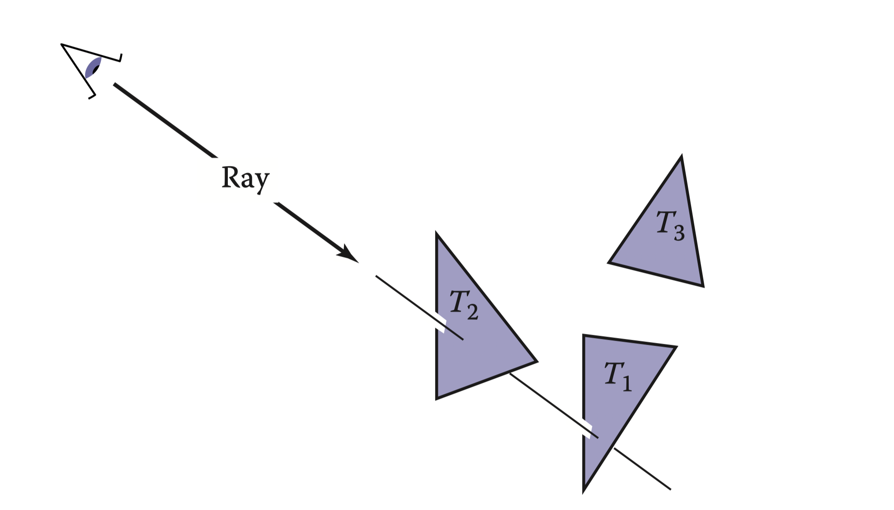
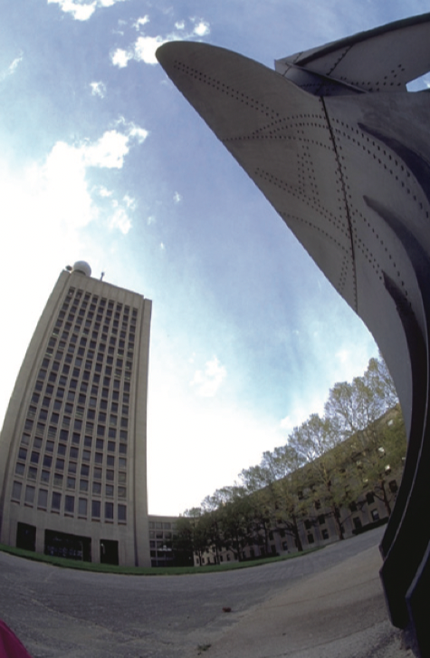
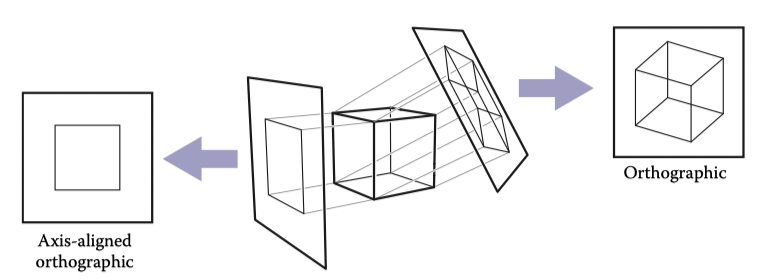
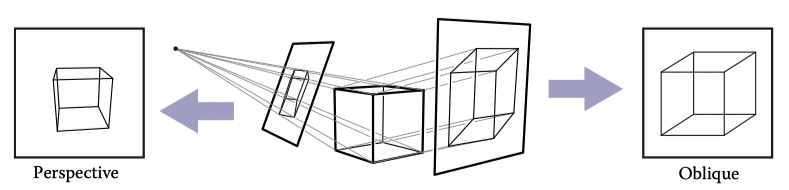
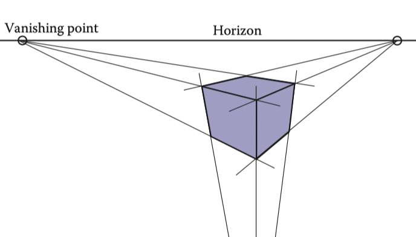
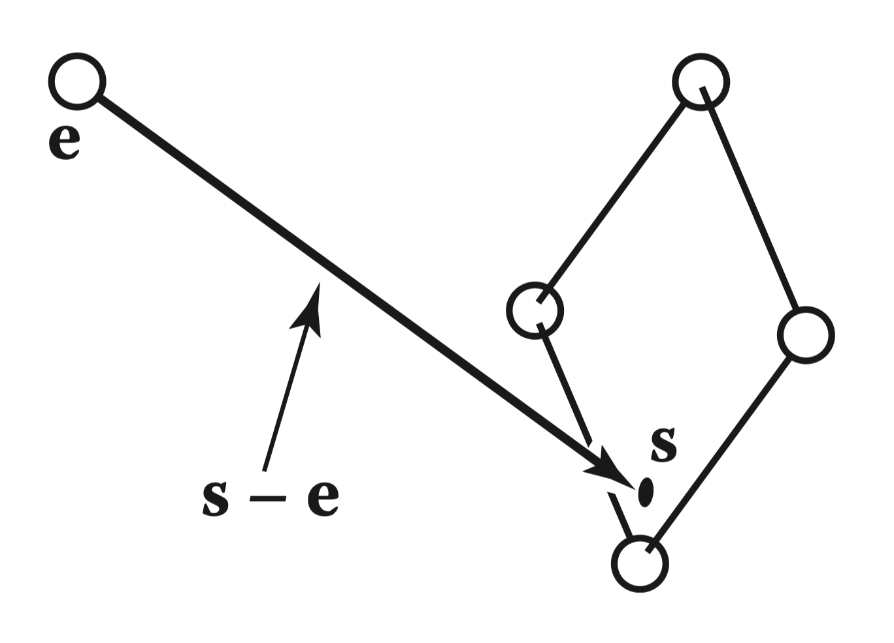

# 4 光线追踪

计算机图形学的一个基本任务是渲染三维图像：获取由排列在 3D 空间中的多个几何对象组成的场景或模型，并生成从特定视点观察到的对象的 2D 图像。这与几个世纪以来建筑师和工程师通过绘制图纸来将他们的设计传达给其他人的做法相同。

从根本上讲，渲染是将一组对象作为输入并生成一个像素阵列作为输出的过程。不管怎样，渲染涉及考虑每个对象如何影响每个像素； 它可以用两种常规的方式来组织。在对象顺序渲染中，每个对象被依次考虑，并且对于每个对象，它影响的所有像素都会被找到并更新。在图像顺序渲染中，每个像素被依次考虑，并且对于每个像素，所有影响它的对象都会被找到并且用于计算像素值。你可以思考循环嵌套的差别：在图像顺序渲染中，每个像素在外部进行循环，而在对象顺序循环中，每个对象在外部进行循环。

图像顺序渲染和对象顺序渲染可以计算出完全相同的图像，但它们适用于计算不同类型的效果，并具有完全不同的性能特征。在我们讨论了这两种方法之后，我们将在 Chapter 8 中探讨它们的比较优劣，但总的来说，图像顺序渲染更容易实现，并且能够产生更多的效果，但通常（虽然不总是）需要比另一种方法更长的执行时间来生成一张可比较的图像。

光线追踪是用于制作三维场景渲染的图像顺序算法，我们将首先考虑它，因为这样可以在不学习用于基于对象顺序渲染的数学工具的情况下实现光线追踪器的功能。

## 4.1 基本的光线追踪算法

光线追踪器逐个计算每个像素，对于每个像素，基本任务是找到图像中在该像素位置能被看到的对象。每个像素“看”的方向不同，任何像素所看到的物体都必须与视图光线相交，这是一条从视点向像素方向发射的线。我们想要的特定物体是与视图光线相交距离最近的物体，因为它挡住了它后面的任何其他物体的视图。一旦找到了该物体，一个着色计算器使用交点、表面法线和其他信息（取决于所需的渲染类型）来确定像素的颜色。这在 Figure 4.1 中显示，其中光线与两个三角形相交，但只有第一个三角形 $T_2$ 被着色。

::: center

**Figure 4.1.** 此光线被“追踪”到场景中，并且第一个被撞到的物体就是通过该像素看到的物体。在这种情况下，返回的是三角形 $T_2$。
:::

因此，一个基本的光线追踪器由三部分组成：

1. 光线生成，根据相机的几何信息计算出每个像素的视图光线的起点和方向；
2. 光线相交，找到与视图光线相交的最近物体；
3. 着色，根据光线相交的结果计算像素的颜色。

光线追踪程序的基本结构如下：

```
for each pixel do
    compute viewing ray
    find first object hit by ray and its surface normal n
    set pixel color to value computed from hit point, light, and n
```

本章介绍了用于光线生成、光线相交和着色的基本方法，这些方法足以实现一个简单的演示光线追踪器。对于一个真正有用的系统，需要添加 Chapter 12 中更高效的光线相交技术，并使用 Chapter 10 中更高级的着色方法和 Chapter 13 中的其他渲染技术，才能发挥光线追踪器的真正潜力。

## 4.2 透视

在计算机出现的数百年之前，艺术家们就已经研究了用二维图像或绘画来表现三维物体或场景的问题。照片也通过二维图像来表现三维场景。虽然有很多非传统的制图方法，例如立体主义绘画、鱼眼镜头（Figure 4.2）和外围摄像头，但对于艺术、摄影以及计算机图形学而言，标准的方法是线性透视，即将三维物体投射到图像平面上，使得场景中的直线变为图像中的直线。

::: center

**Figure 4.2.** 使用鱼眼镜头拍摄的图像不是线性透视图像。图片由 Philip Greenspun 提供。
:::

最简单的投影类型是平行投影，其中3D点沿着投影方向移动，直到它们碰到图像平面，将它们映射到 2D 平面上（Figures 4.3–4.4)）。产生的视图由投影方向和图像平面的选择决定。如果图像平面与视图方向垂直，则投影称为正交投影；否则称为斜投影。

::: center

**Figure 4.3.** 当投影线相互平行并垂直于图像平面时，所得到的视图被称为正交视图。
:::

平行投影经常被用于机械和建筑图纸中，因为它们能够保持平行线的平行性，并保持平行于图像平面的平面对象的大小和形状不变。

::: center

**Figure 4.4.** 图像平面和投影方向成一定角度的平行投影被称为斜投影（右图）。在透视投影中，所有的投影线都经过视点，而不是平行的（左图）。所示的透视视图是非斜的，因为通过图像中心绘制的投影线垂直于图像平面。
:::

平行投影的优点同时也是它的局限性。在我们的日常经验中（甚至在照片中），随着物体远离我们，它们看起来会变小，因此，远处的平行线看起来并不平行。这是因为眼睛和相机并不是从一个视图方向收集光线，它们收集通过特定视点的光线。正如自文艺复兴时期以来艺术家所认识到的那样，我们可以使用透视投影来产生自然的景观：我们沿着通过单一视点的线进行投影，而不是沿着平行线（Figure 4.4）。通过这种方式，远离视点的物体在投影时自然而然地变小。透视视图取决于视点（而不是投影方向）和图像平面的选择。与平行视图一样，有斜透视视图和非斜透视视图；这种区别是基于图像中心的投影方向确定的。

::: center

**Figure 4.5.** 在三点透视中，艺术家会选择平行线相交的“消失点”。平行的水平线会在地平线上相交。每组平行线都有自己的消失点。如果我们根据正确的几何原理实现透视，这些规则会自动遵循。
:::

你可能学过艺术上的三点透视约定，这是一种手动构建透视视图的系统（Figure 4.5）。关于透视的一个惊人的事实是，如果我们遵循透视的简单数学规则，即对象直接朝向眼睛投影，并且它们被画在眼睛前面的视图平面上相遇的位置，那么所有透视绘画的规则都将自动遵循。

## 4.3 计算视图光线

从前一节可以看出，光线生成的基本工具是视点（对于平行视图则是视图方向）和图像平面。有许多方法可以解决摄像机几何的细节问题；在本节中，我们将介绍一种基于规范正交基的方法，它能够支持正常和斜向平行视图以及正交视图。

::: center

**Figure 4.6.** 眼睛到图像平面上某个点的光线。
:::

为了生成光线，我们首先需要一个光线的数学表示。光线实际上只是一个起点和一个传播方向；一个三维参数化的直线非常适合这个目的。正如在 Section 2.5.7 中所讨论的那样，从眼睛 $e$ 到图像平面上的一个点 $s$ 的三维参数化直线（Figure 4.6）可以用以下公式表示：

$$
p(t) = e +t(s-e)
$$

这可以解释为：“我们沿着向量 $(s-e)$ 从点 $e$ 出发前进一段分数距离 $t$ 来找到点 $p$。”因此，给定 $t$，我们可以确定一个点 $p$。点 $e$ 是光线的起点，$(s-e)$ 是光线的方向。

注意到 $p(0) = e$, 并且 $p(1) = s$，更一般地，如果 $0 < t_1 < t_2$，那么 $p(t_1)$ 比 $p(t_2)$ 更靠近眼睛。另外，如果 $t<0$，则 $p(t)$ 在眼睛“后面”。这些事实在我们搜索最接近被光线击中的不在眼睛后面的对象时将会有用。

为了计算一个视线，我们需要知道 $e$（已知）和 $s$。找到 $s$ 可能看起来很困难，但如果我们用正确的坐标系来看待这个问题，实际上是很简单的。

我们所有的光线生成方法都始于一个正交坐标系，即相机坐标系，我们用 $e$ 表示视点或观察点，用 $u$、$v$ 和 $w$ 表示三个基向量，其中 $u$ 指向右侧（从相机的视角），$v$ 指向上方，$w$ 指向后方，以使 ${u，v，w}$ 形成一个右手坐标系。构建相机坐标系的最常见方法是从视点开始，将其作为 $e$，将视线方向作为 $-w$，将上向量用于构建一个基向量，使 $v$ 和 $w$ 在由视线方向和上方向定义的平面上，使用 Section 2.4.7 中描述的从两个向量构建正交基向量的过程。


## 4.4 光线与物体相交

## 4.5 着色

## 4.6 光线追踪程序

## 4.7 阴影

## 4.8 理想的镜面反射

## 4.9 历史记录
