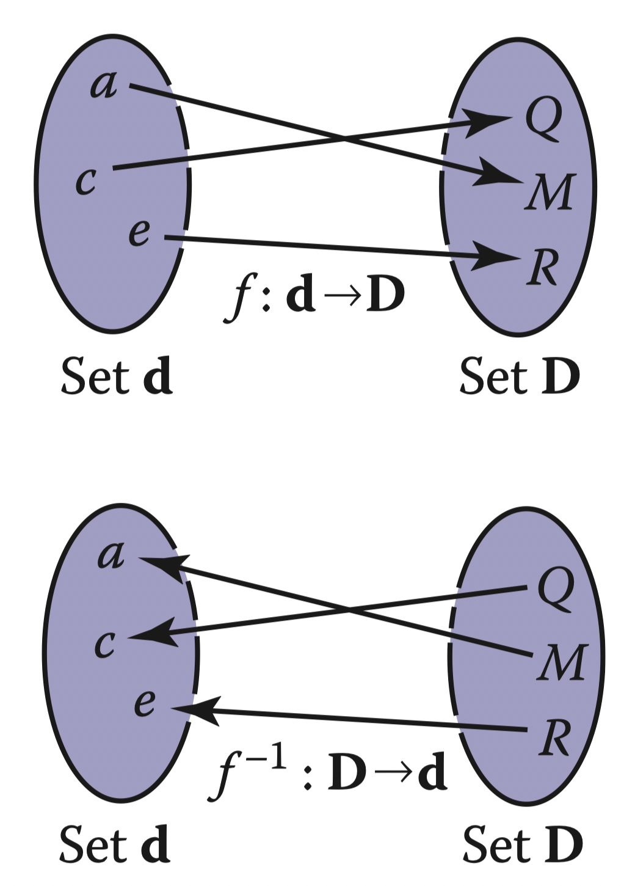
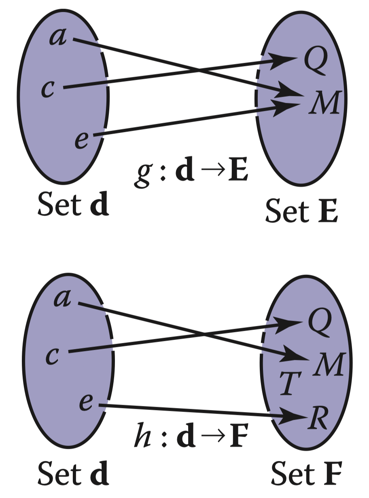
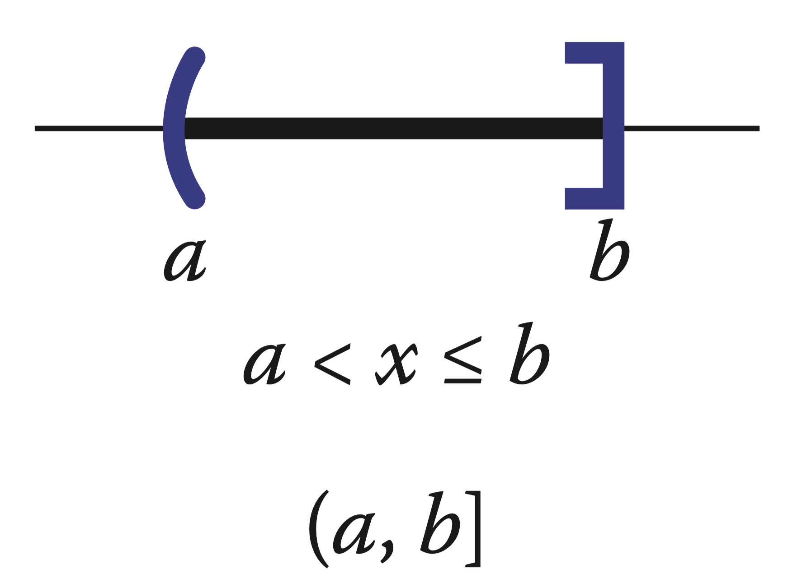
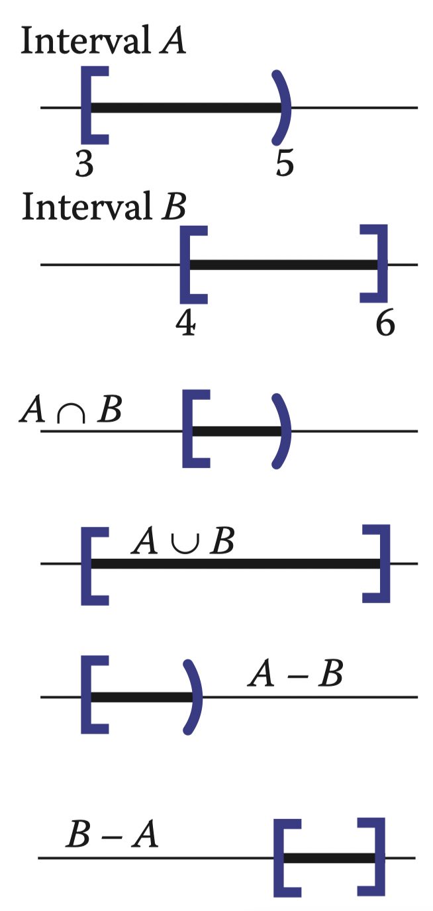
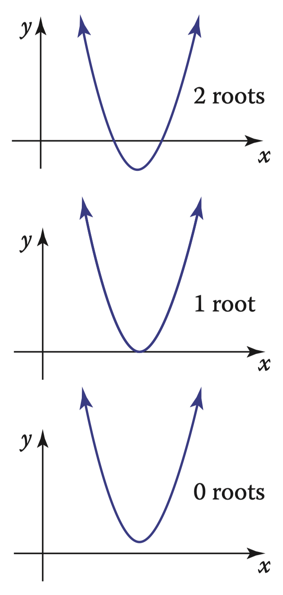
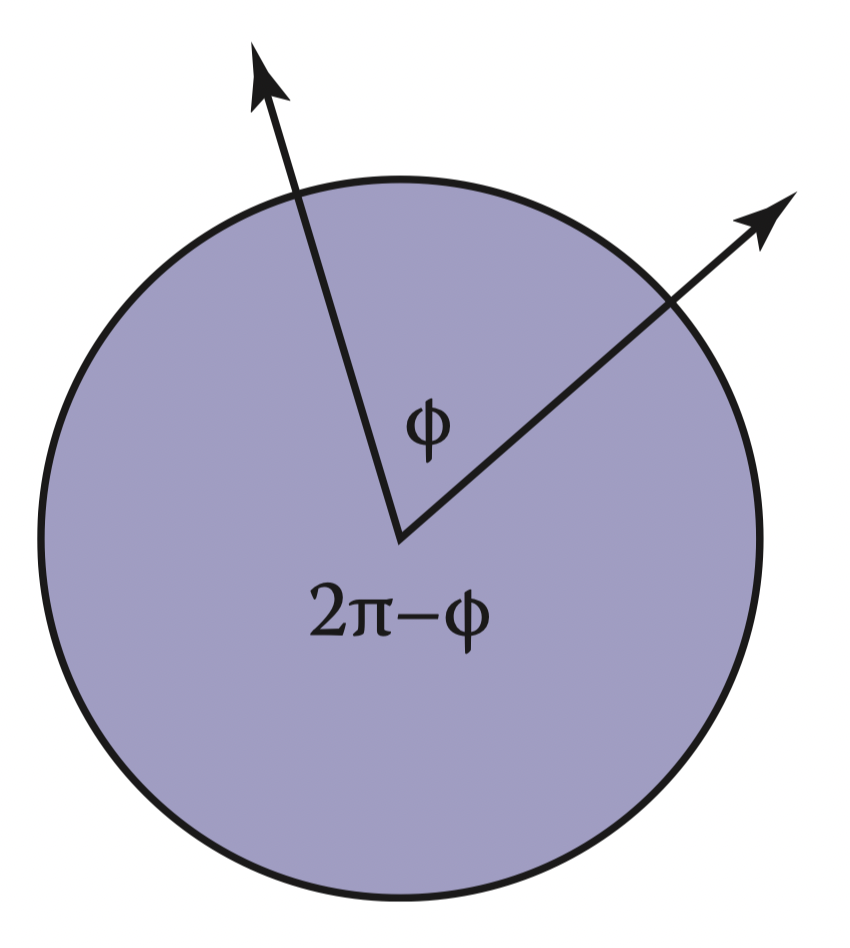
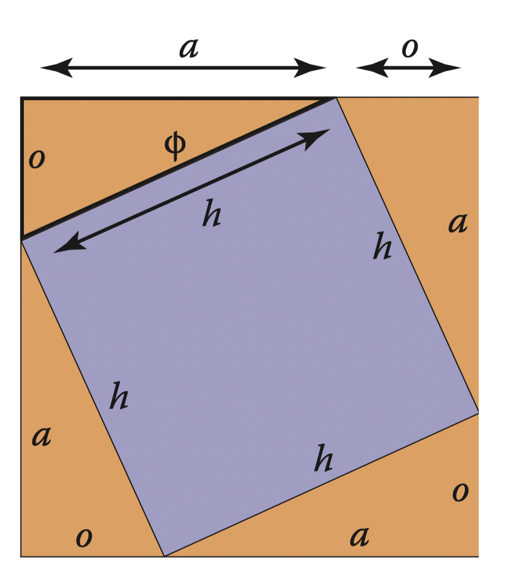
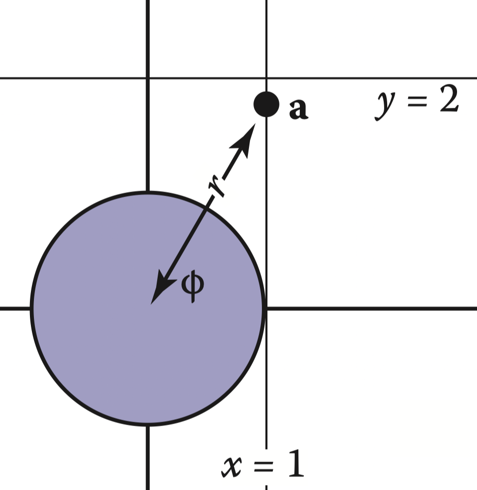
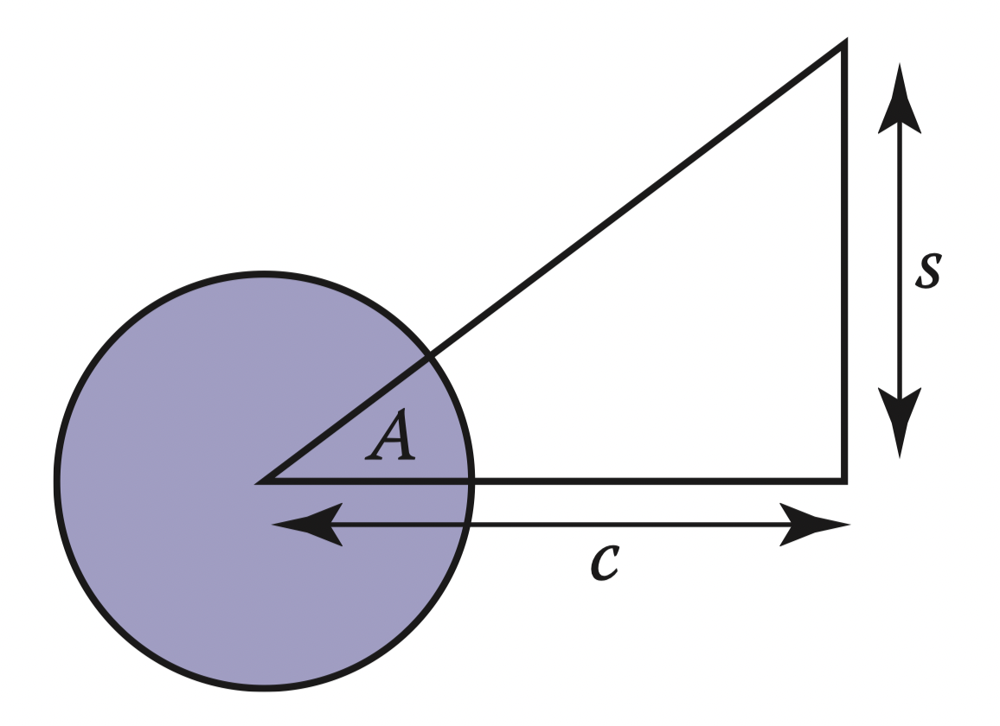
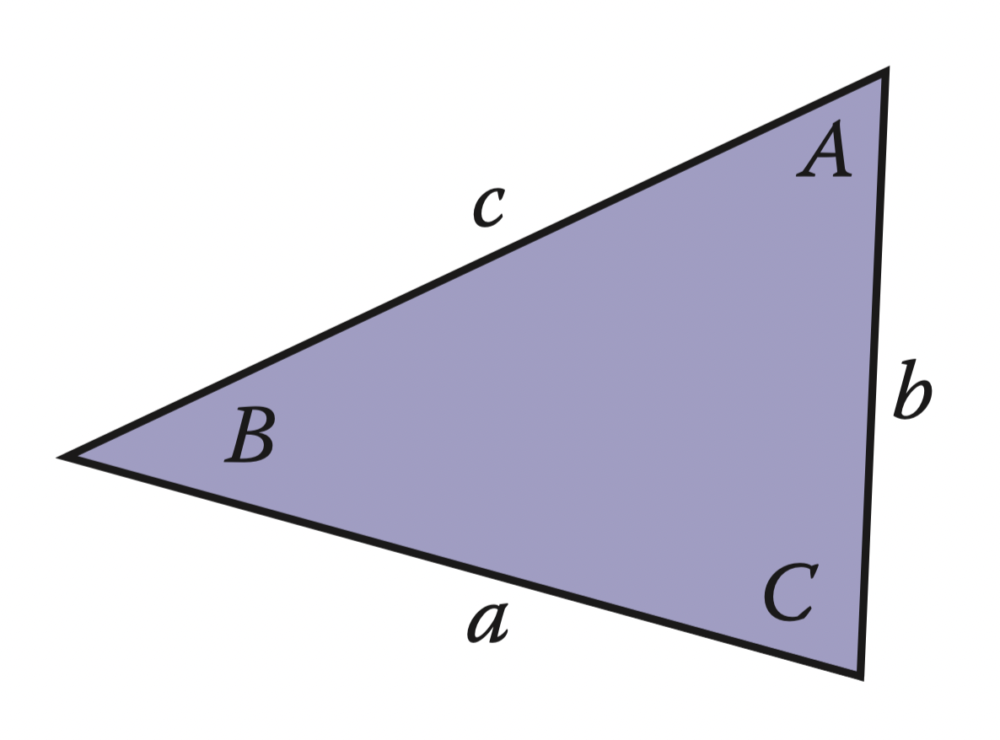

# 2 Miscellaneous Math

Much of graphics is just translating math directly into code. The cleaner the math, the cleaner the resulting code; so much of this book concentrates on using just the right math for the job. This chapter reviews various tools from high school and college mathematics and is designed to be used more as a reference than as a tutorial. It may appear to be a hodge-podge of topics and indeed it is; each topic is chosen because it is a bit unusual in “standard” math curricula, because it is of central importance in graphics, or because it is not typically treated from a geometric standpoint. In addition to establishing a review of the notation used in the book, the chapter also emphasizes a few points that are sometimes skipped in the standard undergraduate curricula, such as barycentric coordinates on triangles. This chapter is not intended to be a rigorous treatment of the material; instead intuition and geometric interpretation are emphasized. A discussion of linear algebra is deferred until Chapter 5 just before transformation matrices are discussed. Readers are encouraged to skim this chapter to familiarize themselves with the topics covered and to refer back to it as needed. The exercises at the end of the chapter may be useful in determining which topics need a refresher.

## 2.1 Sets and Mappings

Mappings, also called functions, are basic to mathematics and programming. Like a function in a program, a mapping in math takes an argument of one type and maps it to (returns) an object of a particular type. In a program we say “type”; in math we would identify the set. When we have an object that is a member of a set, we use the $\in$ symbol. For example,

$$
a \in S
$$

can be read “$a$ is a member of set $S$.” Given any two sets $A$ and $B$, we can create a third set by taking the Cartesian product of the two sets, denoted $A \times B$. This set $A \times B$ is composed of all possible ordered pairs $(a, b)$ where $a \in A$ and $b \in B$. As a shorthand, we use the notation $A^2$ to denote $A \times A$. We can extend the Cartesian product to create a set of all possible ordered triples from three sets and so on for arbitrarily long ordered tuples from arbitrarily many sets.

Common sets of interest include:

- $R$ the real numbers;
- $R^{+}$ the nonnegative real numbers (includes zero);
- $R^2$ the ordered pairs in the real 2D plane;
- $R^n$ the points in n-dimensional Cartesian space;
- $Z$ the integers;
- $S^2$ the set of 3D points (points in $R^3$) on the unit sphere.

Note that although $S^2$ is composed of points embedded in three-dimensional space, they are on a surface that can be parameterized with two variables, so it can be thought of as a 2D set. Notation for mappings uses the arrow and a colon, for example:

$$
f: R \longmapsto Z
$$

which you can read as “There is a function called $f$ that takes a real number as input and maps it to an integer.” Here, the set that comes before the arrow is called the domain of the function, and the set on the right-hand side is called the target. Computer programmers might be more comfortable with the following equivalent language: “There is a function called $f$ which has one real argument and returns an integer.” In other words, the set notation above is equivalent to the common programming notation:

::: center
integer $f$(real) $\leftarrow$ equivalent $\rightarrow$ $f: R \longmapsto Z$
:::

So the colon-arrow notation can be thought of as a programming syntax. It’s that simple.

The point $f(a)$ is called the image of $a$, and the image of a set $A$ (a subset of the domain) is the subset of the target that contains the images of all points in $A$. The image of the whole domain is called the range of the function.

### 2.1.1 Inverse Mappings

::: center

**Figure 2.1.** A bijection $f$ and the inverse function $f^{−1}$ . Note that $f^{–1}$ is also a bijection.
:::

If we have a function $f: A \longmapsto B$, there may exist an inverse function $f^{-1}: B \longmapsto A$, which is defined by the rule $f^{-1}(b)$ where $b = f(a)$. This definition only works if every $b \in B$ is an image of some point under $f$ (that is, the range equals the target) and if there is only one such point (that is, there is only one $a$ for which $f(a) = b$). Such mappings or functions are called bijections. A bijection maps every $a \in A$ to a unique $b \in B$, and for every $b \in B$, there is exactly one $a \in A$ such that $f(a) = b$ (Figure 2.1). A bijection between a group of riders and horses indicates that everybody rides a single horse, and every horse is ridden. The two functions would be rider(horse) and horse(rider). These are inverse functions of each other. Functions that are not bijections have no inverse (Figure 2.2).

::: center

**Figure 2.2.** The function $g$ does not have an inverse because two elements of $d$ map to the same element of $E$. The function $h$ has no inverse because element $T$ of $F$ has no element of $d$ mapped to it.
:::

An example of a bijection is $f : R \rightarrow R$, with $f(x) = x^3$. The inverse function is $f^{−1}(x) = \sqrt[3]{x}$. This example shows that the standard notation can be somewhat awkward because $x$ is used as a dummy variable in both $f$ and $f^{−1}$. It is sometimes more intuitive to use different dummy variables, with $y = f(x)$ and  $x = f^{-1}(y). This yields the more intuitive $y = x^3$ and $x = \sqrt[3]{y}$. An example of a function that does not have an inverse is sqr : $R \rightarrow R$, where $sqr(x) = x^2$. This is true for two reasons: first $x^2 = (−x)^2$, and second no members of the domain map to the negative portions of the target. Note that we can define an inverse if we restrict the domain and range to $R^{+}$. Then $\sqrt{x}$ is a valid inverse.

### 2.1.2 Intervals

Often we would like to specify that a function deals with real numbers that are restricted in value. One such constraint is to specify an interval. An example of an interval is the real numbers between zero and one, not including zero or one. We denote this $(0, 1)$. Because it does not include its endpoints, this is referred to as an open interval. The corresponding closed interval, which does contain its endpoints, is denoted with square brackets: $[0, 1]$. This notation can be mixed, i.e., $[0, 1)$ includes zero but not one. When writing an interval $[a, b]$, we assume that $a \le b$. The three common ways to represent an interval are shown in Figure 2.3. The Cartesian products of intervals are often used. For example, to indicate that $a$ point $x$ is in the unit cube in 3D, we say $x \in [0, 1]^3$.

::: center

**Figure 2.3.** Three equivalent ways to denote the interval from $a$ to $b$ that includes $b$ but not $a$.
:::

Intervals are particularly useful in conjunction with set operations: intersection, union, and difference. For example, the intersection of two intervals is the set of points they have in common. The symbol $\cap$ is used for intersection. For example, $[3, 5) \cap [4, 6] = [4, 5)$. For unions, the symbol $\cup$ is used to denote points in either interval. For example, $[3, 5) \cup [4, 6] = [3, 6]$. Unlike the first two operators, the difference operator produces different results depending on argument order.

::: center

**Figure 2.4.** Interval operations on $[3,5)$ and $[4,6]$.
:::

The minus sign is used for the difference operator, which returns the points in the left interval that are not also in the right. For example, $[3, 5) − [4, 6] = [3, 4)$ and $[4, 6] − [3, 5) = [5, 6]$. These operations are particularly easy to visualize using interval diagrams (Figure 2.4).

### 2.1.3 Logarithms

Although not as prevalent today as they were before calculators, logarithms are often useful in problems where equations with exponential terms arise. By definition, every logarithm has a base $a$. The “log base $a$” of $x$ is written $\log_a x$ and is defined as “the exponent to which a must be raised to get $x$,” i.e.,

$$
y = \log_a x \Leftrightarrow a^y = x
$$

Note that the logarithm base $a$ and the function that raises a to a power are inverses of each other. This basic definition has several consequences:

$$
a^{\log_a {x}} = x
$$

$$
\log_a (a^x) = x
$$

$$
\log_a (xy) = \log_a x + \log_a y
$$

$$
\log_a (x/y) = \log_a x - \log_a y
$$

$$
\log_a x= \log_a b \log_b x
$$

When we apply calculus to logarithms, the special number $e = 2.718...$ often turns up. The logarithm with base $e$ is called the natural logarithm. We adopt the common shorthand ln to denote it:

$$
\ln x \equiv \log_e x
$$

Note that the “$\equiv$” symbol can be read “is equivalent by definition.” Like $\pi$, the special number $e$ arises in a remarkable number of contexts. Many fields use a particular base in addition to $e$ for manipulations and omit the base in their notation, i.e., $\log x$. For example, astronomers often use base 10 and theoretical computer scientists often use base 2. Because computer graphics borrows technology from many fields we will avoid this shorthand.

The derivatives of logarithms and exponents illuminate why the natural logarithm is “natural”:

$$
\frac{d}{dx} \log_a x = \frac{1}{x \ln a}
$$

$$
\frac{d}{dx} a^x = a^x \ln a
$$

The constant multipliers above are unity only for $a = e$.

## 2.2 Solving Quadratic Equations

A quadratic equation has the form

$$
Ax^2 + Bx + C = 0
$$

where $x$ is a real unknown, and $A$, $B$, and $C$ are known constants. If you think of a 2D $xy$ plot with $y = Ax^2 + Bx + C$, the solution is just whatever $x$ values are “zero crossings” in $y$. Because $y = Ax^2 + Bx + C$ is a parabola, there will be zero, one, or two real solutions depending on whether the parabola misses, grazes, or hits the x-axis (Figure 2.5).

::: center

**Figure 2.5.** The geometric interpretation of the roots of a quadratic equation is the intersection points of a parabola with the x-axis.
:::

To solve the quadratic equation analytically, we first divide by $A$:

$$
x^2 + \frac{B}{A}x + \frac{C}{A} = 0
$$

Then we “complete the square” to group terms:

$$
(x+\frac{B}{2A})^2 - \frac{B^2}{4A^2} + \frac{C}{A} = 0
$$

Moving the constant portion to the right-hand side and taking the square root gives

$$
x + \frac{B}{2A} = \pm \sqrt{\frac{B^2}{4A^2}-\frac{C}{A}}
$$

Subtracting $B/(2A)$ from both sides and grouping terms with the denominator $2A$ gives the familiar form:

$$
x = \frac{-B \pm \sqrt{B^2-4AC}}{2A}
$$

Here the “$\pm$” symbol means there are two solutions, one with a plus sign and one with a minus sign. Thus $3 \pm 1$ equals “two or four.” Note that the term that determines the number of real solutions is

$$
D = \equiv B^2 -4AC
$$

which is called the discriminant of the quadratic equation. If $D > 0$, there are two real solutions (also called roots). If $D = 0$, there is one real solution (a “double” root). If $D < 0$, there are no real solutions.

For example, the roots of $2x^2 + 6x + 4 = 0$ are $x = −1$ and $x = −2$, and the equation $x^2 + x + 1$ has no real solutions. The discriminants of these equations are $D = 4$ and $D = −3$, respectively, so we expect the number of solutions given. In programs, it is usually a good idea to evaluate $D$ first and return “no roots” without taking the square root if $D$ is negative.

## 2.3 Trigonometry

In graphics we use basic trigonometry in many contexts. Usually, it is nothing too fancy, and it often helps to remember the basic definitions.

### 2.3.1 Angles

Although we take angles somewhat for granted, we should return to their definition so we can extend the idea of the angle onto the sphere. An angle is formed between two half-lines (infinite rays stemming from an origin) or directions, and some convention must be used to decide between the two possibilities for the angle created between them as shown in Figure 2.6. An angle is defined by the length of the arc segment it cuts out on the unit circle. A common convention is that the smaller arc length is used, and the sign of the angle is determined by the order in which the two half-lines are specified. Using that convention, all angles are in the range $[−\pi, \pi]$.

::: center

Figure 2.6. Two halflines cut the unit circle into two arcs. The length of either arc is a valid angle “between” the two half-lines. Either we can use the convention that the smaller length is the angle, or that the two halflines are specified in a certain order and the arc that determines angle $\phi$ is the one swept out counterclockwise from the first to the second half-line.
:::

Each of these angles is the length of the arc of the unit circle that is “cut” by the two directions. Because the perimeter of the unit circle is $2\pi$, the two possible angles sum to $\pi$. The unit of these arc lengths is radians. Another common unit is degrees, where the perimeter of the circle is 360 degrees. Thus, an angle that is $\pi$ radians is 180 degrees, usually denoted $180^\circ$ . The conversion between degrees and radians is

:::center
degrees = $\frac{180}{\pi}$ radians

radians = $\frac{\pi}{180}$ degrees
:::

### 2.3.2 Trigonometric Functions

Given a right triangle with sides of length $a$, $o$, and $h$, where $h$ is the length of the longest side (which is always opposite the right angle), or hypotenuse, an important relation is described by the Pythagorean theorem:

$$
a^2 + o^2 = h^2
$$

You can see that this is true from Figure 2.7, where the big square has area $(a+o)^2$, the four triangles have the combined area $2ao$, and the center square has area $h^2$.

::: center

**Figure 2.7.** A geometric demonstration of the Pythagorean theorem.
:::

Because the triangles and inner square subdivide the larger square evenly, we have $2ao + h^2 = (a+o)^2$, which is easily manipulated to the form above. We define sine and cosine of $\phi$, as well as the other ratio-based trigonometric expressions:

$$
\sin \phi \equiv o/h
$$

$$
\cos \phi \equiv h/0
$$

$$
\cos \phi \equiv a/h
$$

$$
\sec \phi \equiv h/a
$$

$$
\tan \phi \equiv o/a
$$

$$
\cot \phi \equiv a/o
$$

These definitions allow us to set up polar coordinates, where a point is coded as a distance from the origin and a signed angle relative to the positive x-axis (Figure 2.8). Note the convention that angles are in the range $\phi \in (−\pi, \pi]$, and that the positive angles are counterclockwise from the positive x-axis. This convention that counterclockwise maps to positive numbers is arbitrary, but it is used in many contexts in graphics so it is worth committing to memory.

::: center

**Figure 2.8.** Polar coordinates for the point $(x_a, y_a) = (1, \sqrt{3}) is (r_a, \phi_a) = (2, \phi/3)$.
:::

Trigonometric functions are periodic and can take any angle as an argument. For example, $\sin(A) = \sin(A + 2\pi)$. This means the functions are not invertible when considered with the domain $\R$. This problem is avoided by restricting the range of standard inverse functions, and this is done in a standard way in almost all modern math libraries (e.g., (Plauger, 1991)). The domains and ranges are:

$$
asin : [-1, 1] \rightarrow [-\pi/2, \pi/2]
$$

$$
acos : [-1, 1] \rightarrow [0, \pi] \tag{2.2}
$$

$$
atan : R \rightarrow [-\pi/2, \pi/2]
$$

$$
atan2 : R^2 \rightarrow [-\pi, \pi]
$$

The last function, $atan2(s, c)$ is often very useful. It takes an s value proportional to $\sin A$ and $a$ $c$ value that scales $\cos A$ by the same factor and returns $A$. The factor is assumed to be positive. One way to think of this is that it returns the angle of a 2D Cartesian point $(s, c)$ in polar coordinates (Figure 2.9).

::: center

**Figure 2.9.** The function $atan2(s,c)$ returns the angle $A$ and is often very useful in graphics.
:::

### 2.3.3 Useful Identities

This section lists without derivation a variety of useful trigonometric identities.

**Shifting identities:**

$$
\sin(-A) = -\sin A
$$

$$
\cos(-A) = \cos A
$$

$$
\tan(-A) = -\tan A
$$

$$
\sin(\pi/2-A) = \cos A
$$

$$
\cos(\pi/2-A) = \sin A
$$

$$
\tan(\pi/2-A) = \cot A
$$

**Pythagorean identities:**

$$
\sin^2 A + \cos^2 A = 1
$$

$$
\sec^2 A - \tan^2 A = 1
$$

$$
\sec^2 A - \cot^2 A = 1
$$

**Addition and subtraction identities:**

$$
\sin(A+B) = \sin A \cos B + \sin B \cos A
$$

$$
\sin(A-B) = \sin A \cos B - \sin B \cos A
$$

$$
\sin(2A) = 2\sin A \cos B
$$

$$
\cos(A+B) = \cos A \cos B - \sin A \sin B
$$

$$
\cos(A-B) = \cos A \cos B + \sin A \sin B
$$

$$
\cos(2A) = \cos^2 A - \sin^2 A
$$

$$
\tan(A+B) = \frac{\tan A + \tan B}{1 - \tan A \tan B}
$$

$$
\tan(A-B) = \frac{\tan A - \tan B}{1 + \tan A \tan B}
$$

$$
\tan(2A) = \frac{2\tan A}{1 - \tan^2A}
$$

**Half-angle identities:**

$$
\sin^2(A/2) = (1-\cos A)/2
$$

$$
\cos^2(A/2) = (1+\cos A)/2
$$

**Product identities:**

$$
\sin A \sin B = -(\cos(A+B)-\cos(A-B))/2
$$

$$
\sin A \cos B = (\sin(A+B)+\sin(A-B))/2
$$

$$
\cos A \cos B = (\cos(A+B)+\cos(A-B))/2
$$

The following identities are for arbitrary triangles with side lengths $a$, $b$, and $c$, each with an angle opposite it given by $A$, $B$, $C$, respectively (Figure 2.10):

$$
\frac{\sin A}{a} = \frac{\sin B}{b} = \frac{\sin C}{c} \tag{Law of sines}
$$

$$
c^2 = a^2 + b^2 - 2ab\cos C \tag{Law of cosines}
$$

$$
\frac{a+b}{a-b} = \frac{\tan(\frac{A+B}{2})}{\tan(\frac{A-B}{2})}
$$

::: center

**Figure 2.10.** Geometry for triangle laws.
:::

The area of a triangle can also be computed in terms of these side lengths:

::: center
triangle area = $\frac{1}{4} \sqrt{(a + b + c)(−a + b + c)(a − b + c)(a + b − c)}$
:::

## 2.4 Vectors

## 2.5 Curves and Surfaces

## 2.6 Linear Interpolation

## 2.7 Triangles

## Frequently Asked Questions

## Notes

## Exercises