# 3 Raster Images

Most computer graphics images are presented to the user on some kind of raster display. Raster displays show images as rectangular arrays of pixels. A common example is a flat-panel computer display or television, which has a rectangular array of small light-emitting pixels that can individually be set to different colors to create any desired image. Different colors are achieved by mixing varying intensities of red, green, and blue light. Most printers, such as laser printers and ink-jet printers, are also raster devices. They are based on scanning: there is no physical grid of pixels, but the image is laid down sequentially by depositing ink at selected points on a grid.

Rasters are also prevalent in input devices for images. A digital camera contains an image sensor comprising a grid of light-sensitive pixels, each of which records the color and intensity of light falling on it. A desktop scanner contains a linear array of pixels that is swept across the page being scanned, making many measurements per second to produce a grid of pixels.

Because rasters are so prevalent in devices, raster images are the most common way to store and process images. A raster image is simply a 2D array that stores the pixel value for each pixel—usually a color stored as three numbers, for red, green, and blue. A raster image stored in memory can be displayed by using each pixel in the stored image to control the color of one pixel of the display.

But we don’t always want to display an image this way. We might want to change the size or orientation of the image, correct the colors, or even show the image pasted on a moving three-dimensional surface. Even in televisions, the display rarely has the same number of pixels as the image being displayed. Considerations like these break the direct link between image pixels and display pixels. It’s best to think of a raster image as a device-independent description of the image to be displayed, and the display device as a way of approximating that ideal image.

There are other ways of describing images besides using arrays of pixels. A vector image is described by storing descriptions of shapes—areas of color bounded by lines or curves—with no reference to any particular pixel grid. In essence this amounts to storing the instructions for displaying the image rather than the pixels needed to display it. The main advantage of vector images is that they are resolution independent and can be displayed well on very high resolution devices. The corresponding disadvantage is that they must be rasterized before they can be displayed. Vector images are often used for text, diagrams, mechanical drawings, and other applications where crispness and precision are important and photographic images and complex shading aren’t needed.

In this chapter, we discuss the basics of raster images and displays, paying particular attention to the nonlinearities of standard displays. The details of how pixel values relate to light intensities are important to have in mind when we discuss computing images in later chapters.

## 3.1 Raster Devices

Before discussing raster images in the abstract, it is instructive to look at the basic operation of some specific devices that use these images. A few familiar raster devices can be categorized into a simple hierarchy:

- Output
  - Display
    - Transmissive: liquid crystal display (LCD)
    - Emissive: light-emitting diode (LED) display
  - Hardcopy
    - Binary: ink-jet printer
    - Continuous tone: dye sublimation printer
- Input
  - 2D array sensor: digital camera
  - 1D array sensor: flatbed scanner

### 3.1.1 Displays

Current displays, including televisions and digital cinematic projectors as well as displays and projectors for computers, are nearly universally based on fixed arrays of pixels. They can be separated into emissive displays, which use pixels that directly emit controllable amounts of light, and transmissive displays, in which the pixels themselves don’t emit light but instead vary the amount of light that they allow to pass through them. Transmissive displays require a light source to illuminate them: in a direct-viewed display this is a backlight behind the array; in a projector it is a lamp that emits light that is projected onto the screen after passing through the array. An emissive display is its own light source.

::: center
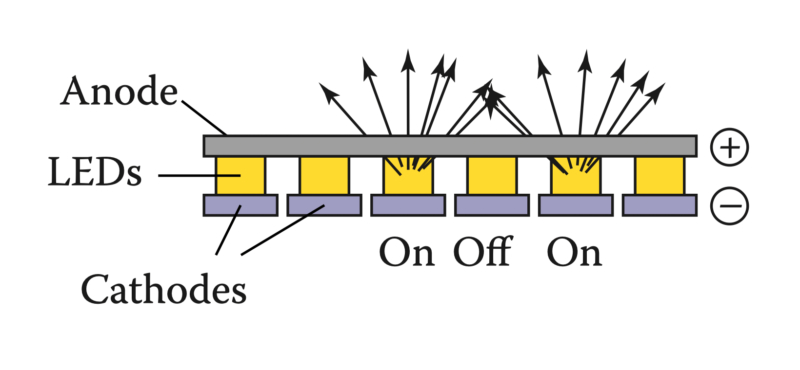
**Figure 3.1.** The operation of a light-emitting diode (LED) display.
:::

Light-emitting diode (LED) displays are an example of the emissive type. Each pixel is composed of one or more LEDs, which are semiconductor devices (based on inorganic or organic semiconductors) that emit light with intensity depending on the electrical current passing through them (see Figure 3.1).

::: center
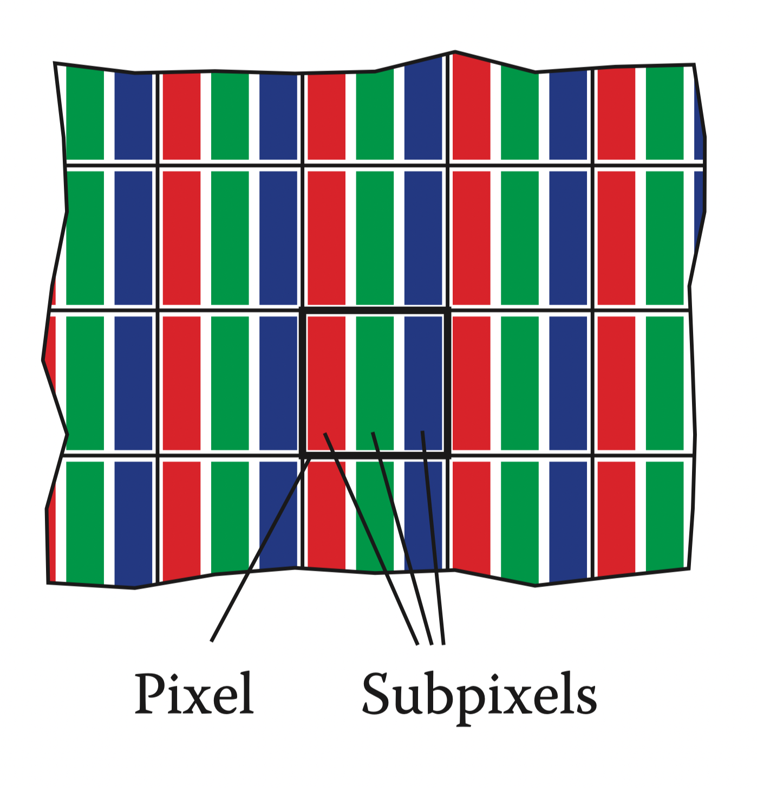
**Figure 3.2.** The red, green, and blue subpixels within a pixel of a flat-panel display.
:::

The pixels in a color display are divided into three independently controlled subpixels—one red, one green, and one blue—each with its own LED made using different materials so that they emit light of different colors (Figure 3.2). When the display is viewed from a distance, the eye can’t separate the individual subpixels, and the perceived color is a mixture of red, green, and blue.

::: center
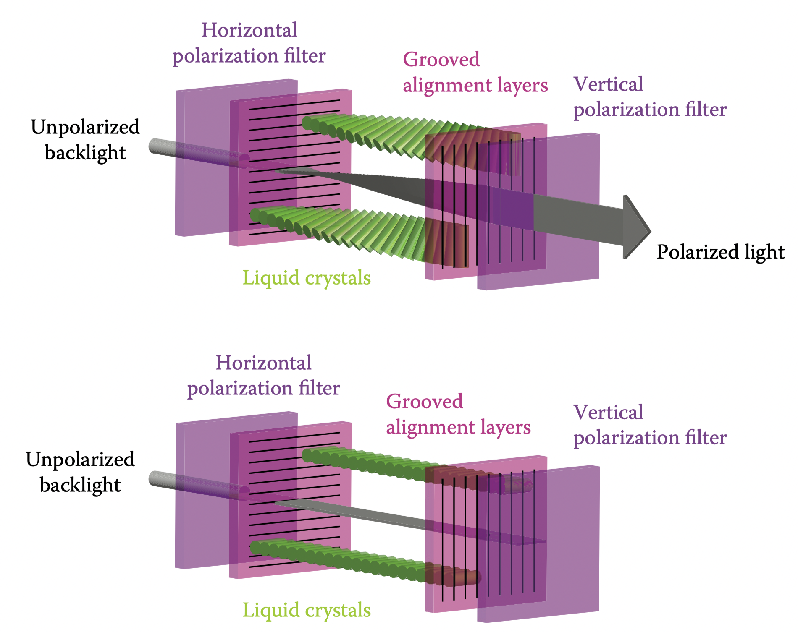
**Figure 3.3.** One pixel of an LCD display in the off state (bottom), in which the front polarizer blocks all the light that passes the back polarizer, and the on state (top), in which the liquid crystal cell rotates the polarization of the light so that it can pass through the front polarizer. Figure courtesy Erik Reinhard (Reinhard, Khan, Aky¨uz, & Johnson, 2008).
:::

Liquid crystal displays (LCDs) are an example of the transmissive type. A liquid crystal is a material whose molecular structure enables it to rotate the polarization of light that passes through it, and the degree of rotation can be adjusted by an applied voltage. An LCD pixel (Figure 3.3) has a layer of polarizing film behind it, so that it is illuminated by polarized light—let’s assume it is polarized horizontally.

::: center
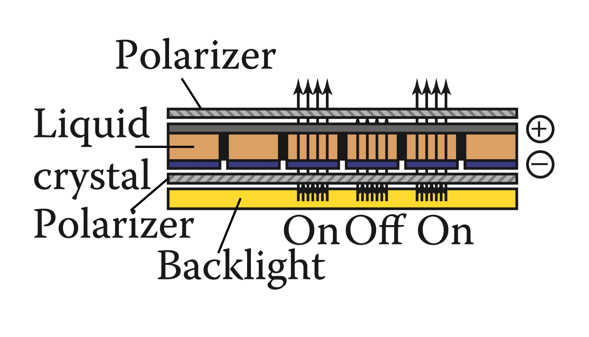
**Figure 3.4.** The operation of a liquid crystal display (LCD).
:::

A second layer of polarizing film in front of the pixel is oriented to transmit only vertically polarized light. If the applied voltage is set so that the liquid crystal layer in between does not change the polarization, all light is blocked and the pixel is in the “off” (minimum intensity) state. If the voltage is set so that the liquid crystal rotates the polarization by 90 degrees, then all the light that entered through the back of the pixel will escape through the front, and the pixel is fully “on”—it has its maximum intensity. Intermediate voltages will partly rotate the polarization so that the front polarizer partly blocks the light, resulting in intensities between the minimum and maximum (Figure 3.4). Like color LED displays, color LCDs have red, green, and blue subpixels within each pixel, which are three independent pixels with red, green, and blue color filters over them.

Any type of display with a fixed pixel grid, including these and other technologies, has a fundamentally fixed resolution determined by the size of the grid. For displays and images, resolution simply means the dimensions of the pixel grid: if a desktop monitor has a resolution of $1920 \times 1200$ pixels, this means that it has 2,304,000 pixels arranged in 1920 columns and 1200 rows.

An image of a different resolution, to fill the screen, must be converted into a $1920 \times 1200$ image using the methods of Chapter 9.

### 3.1.2 Hardcopy Devices

The process of recording images permanently on paper has very different constraints from showing images transiently on a display. In printing, pigments are distributed on paper or another medium so that when light reflects from the paper it forms the desired image. Printers are raster devices like displays, but many printers can only print binary images—pigment is either deposited or not at each grid position, with no intermediate amounts possible.

::: center
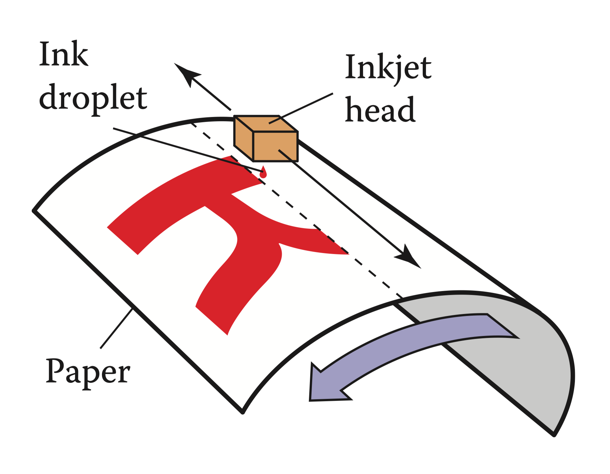
**Figure 3.5.** The operation of an ink-jet printer.
:::

An ink-jet printer (Figure 3.5) is an example of a device that forms a raster image by scanning. An ink-jet print head contains liquid ink carrying pigment, which can be sprayed in very small drops under electronic control. The head moves across the paper, and drops are emitted as it passes grid positions that should receive ink; no ink is emitted in areas intended to remain blank. After each sweep the paper is advanced slightly, and then the next row of the grid is laid down. Color prints are made by using several print heads, each spraying ink with a different pigment, so that each grid position can receive any combination of different colored drops. Because all drops are the same, an ink-jet printer prints binary images: at each grid point there is a drop or no drop; there are no intermediate shades.

An ink-jet printer has no physical array of pixels; the resolution is determined by how small the drops can be made and how far the paper is advanced after each sweep. Many ink-jet printers have multiple nozzles in the print head, enabling several sweeps to be made in one pass, but it is the paper advance, not the nozzle spacing, that ultimately determines the spacing of the rows.

::: center
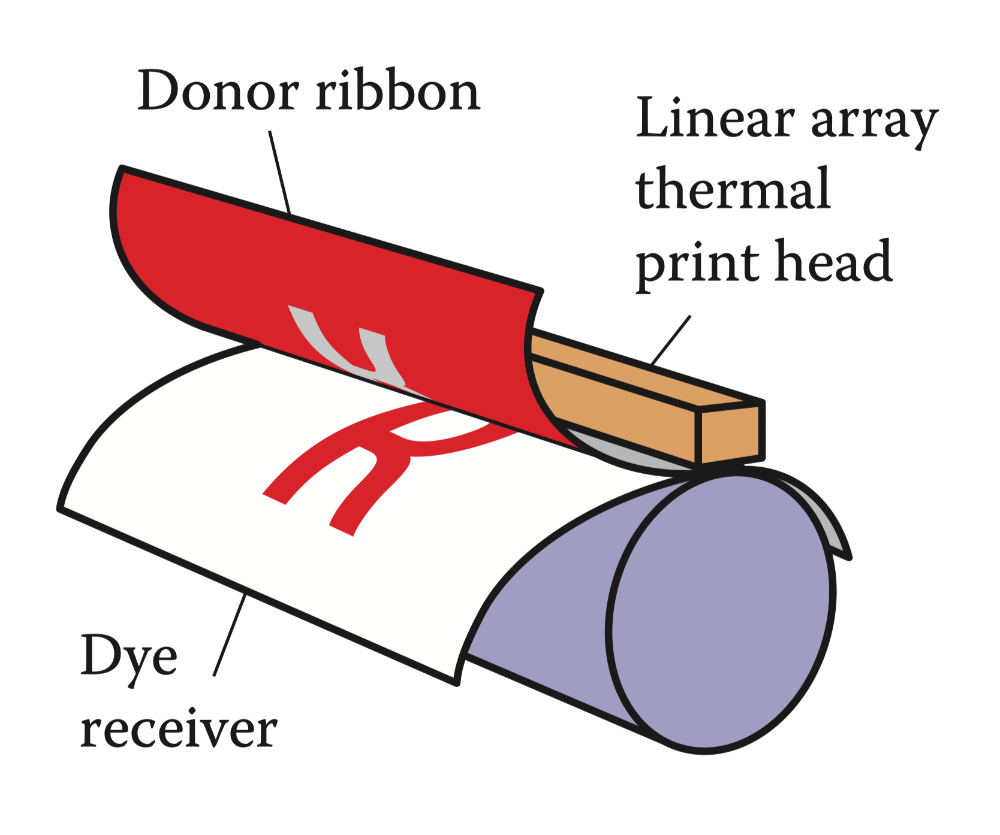
**Figure 3.6.** The operation of a thermal dye transfer printer.
:::

The thermal dye transfer process is an example of a continuous tone printing process, meaning that varying amounts of dye can be deposited at each pixel—it is not all-or-nothing like an ink-jet printer (Figure 3.6). A donor ribbon containing colored dye is pressed between the paper, or dye receiver, and a print head containing a linear array of heating elements, one for each column of pixels in the image. As the paper and ribbon move past the head, the heating elements switch on and off to heat the ribbon in areas where dye is desired, causing the dye to diffuse from the ribbon to the paper. This process is repeated for each of several dye colors. Since higher temperatures cause more dye to be transferred, the amount of each dye deposited at each grid position can be controlled, allowing a continuous range of colors to be produced. The number of heating elements in the print head establishes a fixed resolution in the direction across the page, but the resolution along the page is determined by the rate of heating and cooling compared to the speed of the paper.

Unlike displays, the resolution of printers is described in terms of the pixel density instead of the total count of pixels. So a thermal dye transfer printer that has elements spaced 300 per inch across its print head has a resolution of 300 pixels per inch (ppi) across the page. If the resolution along the page is chosen to be the same, we can simply say the printer’s resolution is 300 ppi. An ink-jet printer that places dots on a grid with 1200 grid points per inch is described as having a resolution of 1200 dots per inch (dpi). Because the ink-jet printer is a binary device, it requires a much finer grid for at least two reasons. Because edges are abrupt black/white boundaries, very high resolution is required to avoid stairstepping, or aliasing, from appearing (see Section 8.3). When continuous-tone images are printed, the high resolution is required to simulate intermediate colors by printing varying-density dot patterns called halftones.

### 3.1.3 Input Devices

Raster images have to come from somewhere, and any image that wasn’t computed by some algorithm has to have been measured by some raster input device, most often a camera or scanner. Even in rendering images of 3D scenes, photographs are used constantly as texture maps (see Chapter 11). A raster input device has to make a light measurement for each pixel, and (like output devices) they are usually based on arrays of sensors.

::: center
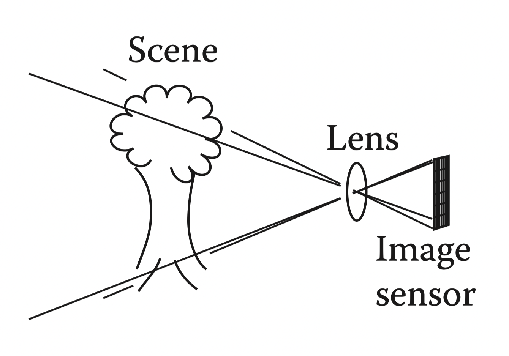
**Figure 3.7.** The operation of a digital camera.
:::

A digital camera is an example of a 2D array input device. The image sensor in a camera is a semiconductor device with a grid of light-sensitive pixels. Two common types of arrays are known as CCDs (charge-coupled devices) and CMOS (complimentary metal–oxide–semiconductor) image sensors. The camera’s lens projects an image of the scene to be photographed onto the sensor, and then each pixel measures the light energy falling on it, ultimately resulting in a number that goes into the output image (Figure 3.7). In much the same way as color displays use red, green, and blue subpixels, most color cameras work by using a color-filter array or mosaic to allow each pixel to see only red, green, or blue light, leaving the image processing software to fill in the missing values in a process known as demosaicking (Figure 3.8).

::: center
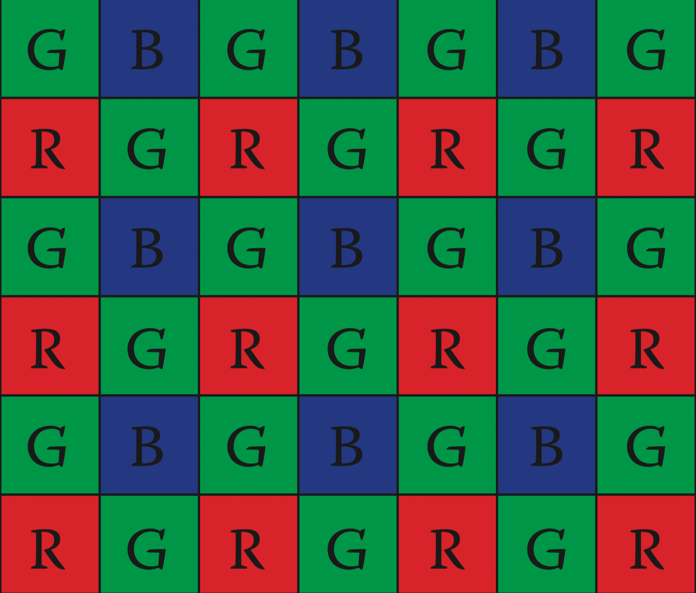
**Figure 3.8.** Most color digital cameras use a color-filter array similar to the Bayer mosaic shown here. Each pixel measures either red, green, or blue light.
:::

Other cameras use three separate arrays, or three separate layers in the array, to measure independent red, green, and blue values at each pixel, producing a usable color image without further processing. The resolution of a camera is determined by the fixed number of pixels in the array and is usually quoted using the total count of pixels: a camera with an array of 3000 columns and 2000 rows produces an image of resolution $3000 \times 2000$, which has 6 million pixels, and is called a 6 megapixel (MP) camera. It’s important to remember that a mosiac sensor does not measure a complete color image, so a camera that measures the same number of pixels but with independent red, green, and blue measurements records more information about the image than one with a mosaic sensor.

::: center
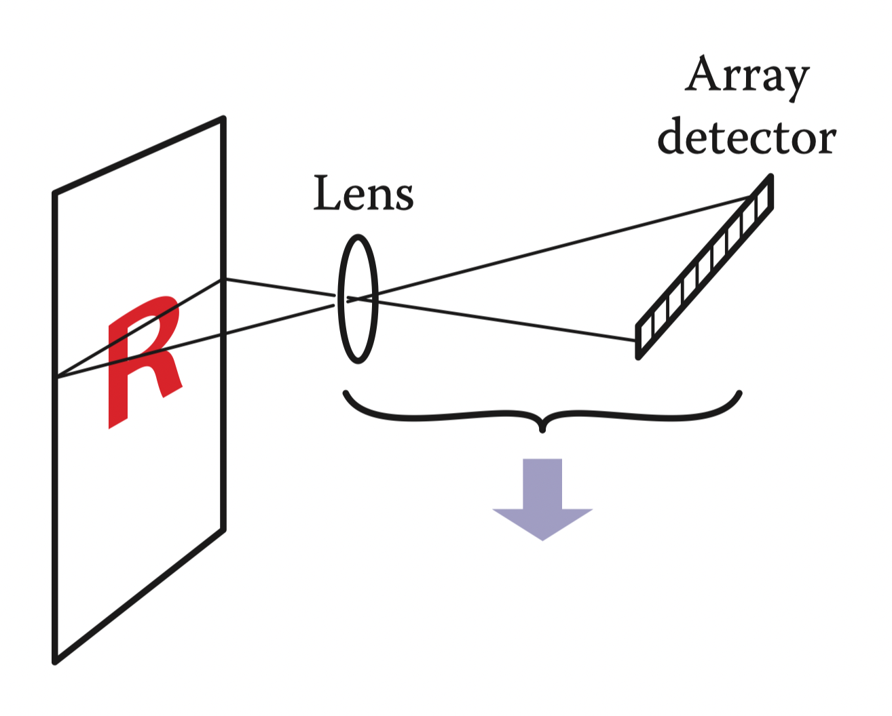
**Figure 3.9.** The operation of a flatbed scanner.
:::

A flatbed scanner also measures red, green, and blue values for each of a grid of pixels, but like a thermal dye transfer printer it uses a 1D array that sweeps across the page being scanned, making many measurements per second. The resolution across the page is fixed by the size of the array, and the resolution along the page is determined by the frequency of measurements compared to the speed at which the scan head moves. A color scanner has a $3 \times n_x$ array, where $n_x$ is the number of pixels across the page, with the three rows covered by red, green, and blue filters. With an appropriate delay between the times at which the three colors are measured, this allows three independent color measurements at each grid point. As with continuous-tone printers, the resolution of scanners is reported in pixels per inch (ppi).

With this concrete information about where our images come from and where they will go, we’ll now discuss images more abstractly, in the way we’ll use them in graphics algorithms.

## 3.2 Images, Pixels, and Geometry

We know that a raster image is a big array of pixels, each of which stores information about the color of the image at its grid point. We’ve seen what various output devices do with images we send to them and how input devices derive them from images formed by light in the physical world. But for computations in the computer, we need a convenient abstraction that is independent of the specifics of any device, that we can use to reason about how to produce or interpret the values stored in images.

When we measure or reproduce images, they take the form of two-dimensional distributions of light energy: the light emitted from the monitor as a function of position on the face of the display; the light falling on a camera’s image sensor as a function of position across the sensor’s plane; the reflectance, or fraction of light reflected (as opposed to absorbed) as a function of position on a piece of paper. So in the physical world, images are functions defined over two-dimensional areas—almost always rectangles. So we can abstract an image as a function

$$
I(x,y): R \rightarrow V
$$

where $R \subset R^2$ is a rectangular area and V is the set of possible pixel values. The simplest case is an idealized grayscale image where each point in the rectangle has just a brightness (no color), and we can say $V = R^+$ (the nonnegative reals). An idealized color image, with red, green, and blue values at each pixel, has $V = (R^+)^3$. We’ll discuss other possibilities for $V$ in the next section.

How does a raster image relate to this abstract notion of a continuous image? Looking to the concrete examples, a pixel from a camera or scanner is a measurement of the average color of the image over some small area around the pixel. A display pixel, with its red, green, and blue subpixels, is designed so that the average color of the image over the face of the pixel is controlled by the corresponding pixel value in the raster image. In both cases, the pixel value is a local average of the color of the image, and it is called a point sample of the image. In other words, when we find the value $x$ in a pixel, it means “the value of the image in the vicinity of this grid point is $x$.” The idea of images as sampled representations of functions is explored further in Chapter 9.

::: center
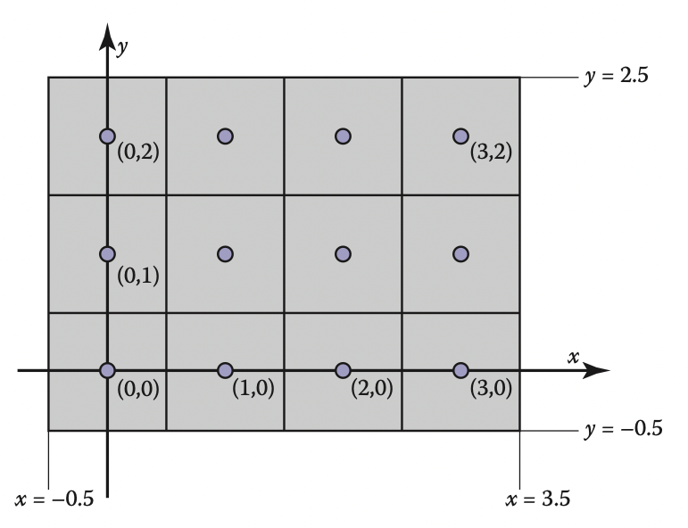
**Figure 3.10.** Coordinates of a four pixel $\times$ three pixel screen. Note that in some APIs the y-axis will point downward.
:::

A mundane but important question is where the pixels are located in 2D space. This is only a matter of convention, but establishing a consistent convention is important! In this book, a raster image is indexed by the pair $(i, j)$ indicating the column $(i)$ and row $(j)$ of the pixel, counting from the bottom left. If an image has $n_x$ columns and $n_y$ rows of pixels, the bottom-left pixel is $(0, 0)$ and the top-right is pixel $(n_x − 1, n_y − 1)$. We need 2D real screen coordinates to specify pixel positions. We will place the pixels’ sample points at integer coordinates, as shown by the $4 \times 3$ screen in Figure 3.10.

The rectangular domain of the image has width $n_x$ and height $n_y$ and is centered on this grid, meaning that it extends half a pixel beyond the last sample point on each side. So the rectangular domain of a $n_x \times n_y$ image is

$$
R = [-0.5, n_x-0.5] \times [-0.5, n_y-0.5]
$$

Again, these coordinates are simply conventions, but they will be important to remember later when implementing cameras and viewing transformations.

### 3.2.1 Pixel Values

So far we have described the values of pixels in terms of real numbers, representing intensity (possibly separately for red, green, and blue) at a point in the image. This suggests that images should be arrays of floating-point numbers, with either one (for grayscale, or black and white, images) or three (for RGB color images) 32-bit floating point numbers stored per pixel. This format is sometimes used, when its precision and range of values are needed, but images have a lot of pixels and memory and bandwidth for storing and transmitting images are invariably scarce. Just one ten-megapixel photograph would consume about 115 MB of RAM in this format.

Less range is required for images that are meant to be displayed directly. While the range of possible light intensities is unbounded in principle, any given device has a decidedly finite maximum intensity, so in many contexts it is perfectly sufficient for pixels to have a bounded range, usually taken to be [0, 1] for simplicity. For instance, the possible values in an 8-bit image are 0, 1/255, 2/255, . . . , 254/255, 1. Images stored with floating-point numbers, allowing a wide range of values, are often called high dynamic range (HDR) images to distinguish them from fixed-range, or low dynamic range (LDR) images that are stored with integers. See Chapter 21 for an in-depth discussion of techniques and applications for high dynamic range images.

Here are some pixel formats with typical applications:

- 1-bit grayscale—text and other images where intermediate grays are not desired (high resolution required);
- 8-bit RGB fixed-range color (24 bits total per pixel)—web and email applications, consumer photographs;
- 8- or 10-bit fixed-range RGB (24–30 bits/pixel)—digital interfaces to computer displays;
- 12- to 14-bit fixed-range RGB (36–42 bits/pixel)—raw camera images for professional photography;
- 16-bit fixed-range RGB (48 bits/pixel)—professional photographyand printing; intermediate format for image processing of fixed-range images;
- 16-bit fixed-range grayscale (16 bits/pixel)—radiology and medical imaging;
- 16-bit “half-precision”floating-point RGB—HDR images; intermediate format for real-time rendering;
- 32-bit floating-point RGB—general-purpose intermediate format for software rendering and processing of HDR images.

Reducing the number of bits used to store each pixel leads to two distinctive types of artifacts, or artificially introduced flaws, in images. First, encoding images with fixed-range values produces clipping when pixels that would otherwise be brighter than the maximum value are set, or clipped, to the maximum representable value. For instance, a photograph of a sunny scene may include reflections that are much brighter than white surfaces; these will be clipped (even if they were measured by the camera) when the image is converted to a fixed range to be displayed. Second, encoding images with limited precision leads to quantization artifacts, or banding, when the need to round pixel values to the nearest representable value introduces visible jumps in intensity or color. Banding can be particularly insidious in animation and video, where the bands may not be objectionable in still images, but become very visible when they move back and forth.

### 3.2.2 Monitor Intensities and Gamma

All modern monitors take digital input for the “value” of a pixel and convert this to an intensity level. Real monitors have some nonzero intensity when they are off because the screen reflects some light. For our purposes we can consider this “black” and the monitor fully on as “white.” We assume a numeric description of pixel color that ranges from zero to one. Black is zero, white is one, and a gray halfway between black and white is 0.5. Note that here “halfway” refers to the physical amount of light coming from the pixel, rather than the appearance. The human perception of intensity is nonlinear and will not be part of the present discussion; see Chapter 20 for more.

There are two key issues that must be understood to produce correct images on monitors. The first is that monitors are nonlinear with respect to input. For example, if you give a monitor 0, 0.5, and 1.0 as inputs for three pixels, the intensities displayed might be 0, 0.25, and 1.0 (off, one-quarter fully on, and fully on). As an approximate characterization of this nonlinearity, monitors are commonly characterized by a $\gamma$ (“gamma”) value. This value is the degree of freedom in the formula

::: center
displayed intensity = (maximum intensity) $a^{\gamma}$
:::

where $a$ is the input pixel value between zero and one. For example, if a monitor has a gamma of 2.0, and we input $a$ value of $a = 0.5$, the displayed intensity will be one fourth the maximum possible intensity because $0.5^2 = 0.25$. Note that $a = 0$ maps to zero intensity and $a = 1$ maps to the maximum intensity regardless of the value of $\gamma$. Describing a display’s nonlinearity using $\gamma$ is only an approximation; we do not need a great deal of accuracy in estimating the $\gamma$ of a device. A nice visual way to gauge the nonlinearity is to find what value of $a$ gives an intensity halfway between black and white. This a will be

$$
0/5 = a^{\gamma}
$$

If we can find that $a$, we can deduce $\gamma$ by taking logarithms on both sides:

$$
\gamma = \frac{\ln 0.5}{\ln a}
$$

We can find this $a$ by a standard technique where we display a checkerboard pattern of black and white pixels next to a square of gray pixels with input $a$ (Figure 3.11), then ask the user to adjust $a$ (with a slider, for instance) until the two sides match in average brightness. When you look at this image from a distance (or without glasses if you are nearsighted), the two sides of the image will look about the same when $a$ is producing an intensity halfway between black and white. This is because the blurred checkerboard is mixing even numbers of white and black pixels so the overall effect is a uniform color halfway between white and black.

::: center
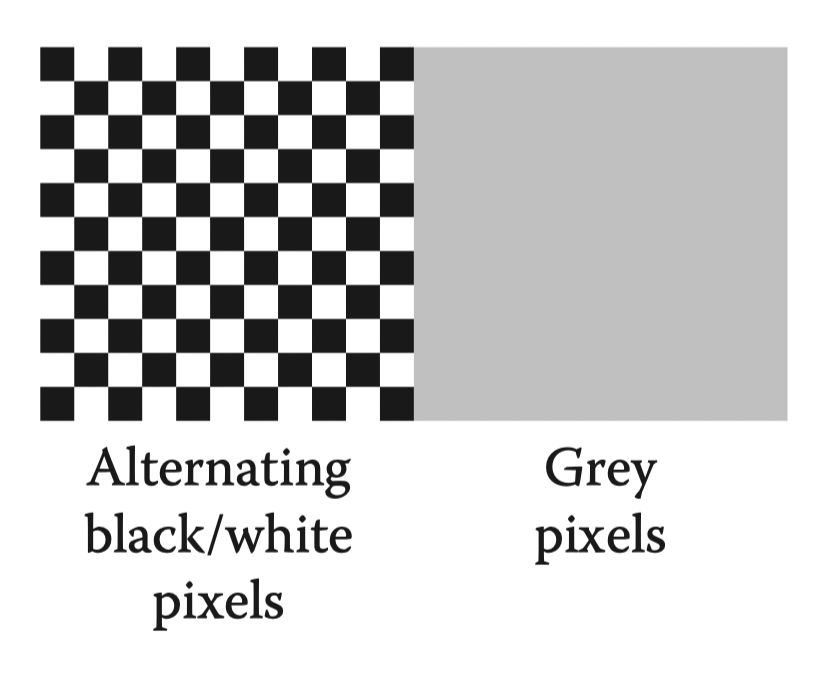
**Figure 3.11.** Alternating black and white pixels viewed from a distance are halfway between black and white. The gamma of a monitor can be inferred by finding a gray value that appears to have the same intensity as the black and white pattern.
:::

Once we know $\gamma$ , we can gamma correct our input so that a value of $a = 0.5$ is displayed with intensity halfway between black and white. This is done with the transformation

::: center
$a^{'} = a^{\frac{1}{\gamma}}$

displayed intensity = $(a^{'})^{\gamma}$ = $(a^{\frac{1}{\gamma}})^{\gamma}$ (maximum intensity) = a (maximum intensity)
:::

Another important characteristic of real displays is that they take quantized input values. So while we can manipulate intensities in the floating point range [0, 1], the detailed input to a monitor is a fixed-size integer. The most common range for this integer is 0–255 which can be held in 8 bits of storage. This means that the possible values for a are not any number in [0, 1] but instead

::: center
possible values for $a = \{\frac{0}{255}, \frac{1}{255}, \frac{2}{255},..., \frac{254}{255}, \frac{255}{255}\}$
:::

This means the possible displayed intensity values are approximately

$$
\{M(\frac{0}{255})^{\gamma}, M(\frac{1}{255})^{\gamma}, M(\frac{2}{255})^{\gamma},...,M(\frac{254}{255})^{\gamma}, M(\frac{255}{255})^{\gamma}\}
$$

where $M$ is the maximum intensity. In applications where the exact intensities need to be controlled, we would have to actually measure the 256 possible intensities, and these intensities might be different at different points on the screen, especially for CRTs. They might also vary with viewing angle. Fortunately, few applications require such accurate calibration.

## 3.3 RGB Color

Most computer graphics images are defined in terms of red-green-blue (RGB) color. RGB color is a simple space that allows straightforward conversion to the controls for most computer screens. In this section, RGB color is discussed from a user’s perspective, and operational facility is the goal. A more thorough discussion of color is given in Chapter 19, but the mechanics of RGB color space will allow us to write most graphics programs. The basic idea of RGB color space is that the color is displayed by mixing three primary lights: one red, one green, and one blue. The lights mix in an additive manner.

In RGB additive color mixing we have (Figure 3.12)

::: center
red + green = yellow

green + blue = cyan

blue + red = magenta

red + green + blue = white
:::

The color “cyan” is a blue-green, and the color “magenta” is a purple.

If we are allowed to dim the primary lights from fully off (indicated by pixel value 0) to fully on (indicated by 1), we can create all the colors that can be displayed on an RGB monitor. The red, green, and blue pixel values create a three-dimensional RGB color cube that has a red, a green, and a blue axis. Allowable coordinates for the axes range from zero to one. The color cube is shown graphically in Figure 3.13.

The colors at the corners of the cube are

::: center
black = (0, 0, 0),

red = (1, 0, 0),

green = (0, 1, 0),

blue = (0, 0, 1),

yellow = (1, 1, 0),

magenta = (1, 0, 1),
:::

Actual RGB levels are often given in quantized form, just like the grayscales discussed in Section 3.2.2. Each component is specified with an integer. The most common size for these integers is one byte each, so each of the three RGB components is an integer between 0 and 255. The three integers together take up three bytes, which is 24 bits. Thus a system that has “24-bit color” has 256 possible levels for each of the three primary colors. Issues of gamma correction discussed in Section 3.2.2 also apply to each RGB component separately.
## 3.4 Alpha Compositing

### 3.4.1 Image Storage

