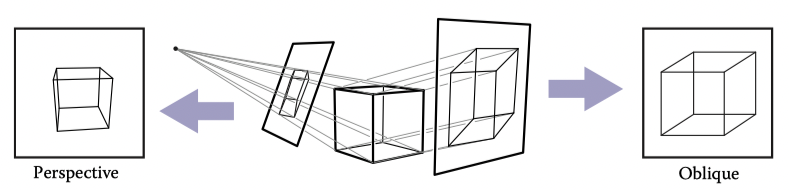
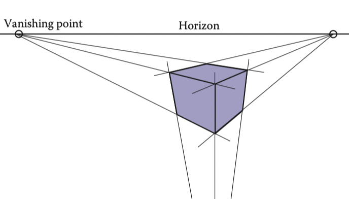

# 4 Ray Tracing

One of the basic tasks of computer graphics is rendering three-dimensional objects: taking a scene, or model, composed of many geometric objects arranged in 3D space and producing a 2D image that shows the objects as viewed from a particular viewpoint. It is the same operation that has been done for centuries by architects and engineers creating drawings to communicate their designs to others.

Fundamentally, rendering is a process that takes as its input a set of objects and produces as its output an array of pixels. One way or another, rendering involves considering how each object contributes to each pixel; it can be organized in two general ways. In object-order rendering, each object is considered in turn, and for each object all the pixels that it influences are found and updated. In image-order rendering, each pixel is considered in turn, and for each pixel all the objects that influence it are found and the pixel value is computed. You can think of the difference in terms of the nesting of loops: in image-order rendering the “for each pixel” loop is on the outside, whereas in object-order rendering the “for each object” loop is on the outside.

Image-order and object-order rendering approaches can compute exactly the same images, but they lend themselves to computing different kinds of effects and have quite different performance characteristics. We’ll explore the comparative strengths of the approaches in Chapter 8 after we have discussed them both, but, broadly speaking, image-order rendering is simpler to get working and more flexible in the effects that can be produced, and usually (though not always) takes much more execution time to produce a comparable image.

Ray tracing is an image-order algorithm for making renderings of 3D scenes, and we’ll consider it first because it’s possible to get a ray tracer working without developing any of the mathematical machinery that’s used for object-order rendering.

## 4.1 The Basic Ray-Tracing Algorithm

A ray tracer works by computing one pixel at a time, and for each pixel the basic task is to find the object that is seen at that pixel’s position in the image. Each pixel “looks” in a different direction, and any object that is seen by a pixel must intersect the viewing ray, a line that emanates from the viewpoint in the direction that pixel is looking. The particular object we want is the one that intersects the viewing ray nearest the camera, since it blocks the view of any other objects behind it. Once that object is found, a shading computation uses the intersection point, surface normal, and other information (depending on the desired type of rendering) to determine the color of the pixel. This is shown in Figure 4.1, where the ray intersects two triangles, but only the first triangle hit, $T_2$ , is shaded.

::: center

**Figure 4.1.** The ray is “traced” into the scene and the first object hit is the one seen through the pixel. In this case, the triangle $T_2$ is returned.
:::

A basic ray tracer therefore has three parts:

1. ray generation, which computes the origin and direction of each pixel’s viewing ray based on the camera geometry;
2. ray intersection, which finds the closest object intersecting the viewing ray;
3. shading, which computes the pixel color based on the results of ray intersection.

The structure of the basic ray tracing program is:

```
for each pixel do
    compute viewing ray
    find first object hit by ray and its surface normal n
    set pixel color to value computed from hit point, light, and n
```

This chapter covers basic methods for ray generation, ray intersection, and shading, that are sufficient for implementing a simple demonstration ray tracer. For a really useful system, more efficient ray intersection techniques from Chapter 12 need to be added, and the real potential of a ray tracer will be seen with the more advanced shading methods from Chapter 10 and the additional rendering techniques from Chapter 13.

## 4.2 Perspective

The problem of representing a 3D object or scene with a 2D drawing or painting was studied by artists hundreds of years before computers. Photographs also represent 3D scenes with 2D images. While there are many unconventional ways to make images, from cubist painting to fisheye lenses (Figure 4.2) to peripheral cameras, the standard approach for both art and photography, as well as computer graphics, is linear perspective, in which 3D objects are projected onto an image plane in such a way that straight lines in the scene become straight lines in the image.

::: center

**Figure 4.2.** An image taken with a fisheye lens is not a linear perspective image. Photo courtesy Philip Greenspun.
:::

The simplest type of projection is parallel projection, in which 3D points are mapped to 2D by moving them along a projection direction until they hit the image plane (Figures 4.3–4.4). The view that is produced is determined by the choice of projection direction and image plane. If the image plane is perpendicular to the view direction, the projection is called orthographic; otherwise it is called oblique.

::: center

**Figure 4.3.** When projection lines are parallel and perpendicular to the image plane, the resulting views are called orthographic.
:::

Parallel projections are often used for mechanical and architectural drawings because they keep parallel lines parallel and they preserve the size and shape of planar objects that are parallel to the image plane.

::: center

**Figure 4.4.** A parallel projection that has the image plane at an angle to the projection direction is called oblique (right). In perspective projection, the projection lines all pass through the viewpoint, rather than being parallel (left). The illustrated perspective view is non-oblique because a projection line drawn through the center of the image would be perpendicular to the image plane.
:::

The advantages of parallel projection are also its limitations. In our everyday experience (and even more so in photographs) objects look smaller as they get farther away, and as a result parallel lines receding into the distance do not appear parallel. This is because eyes and cameras don’t collect light from a single viewing direction; they collect light that passes through a particular viewpoint. As has been recognized by artists since the Renaissance, we can produce naturallooking views using perspective projection: we simply project along lines that pass through a single point, the viewpoint, rather than along parallel lines (Figure 4.4). In this way, objects farther from the viewpoint naturally become smaller when they are projected. A perspective view is determined by the choice of viewpoint (rather than projection direction) and image plane. As with parallel views, there are oblique and non-oblique perspective views; the distinction is made based on the projection direction at the center of the image.

::: center

**Figure 4.5.** In three-point perspective, an artist picks “vanishing points” where parallel lines meet. Parallel horizontal lines will meet at a point on the horizon. Every set of parallel lines has its own vanishing points. These rules are followed automatically if we implement perspective based on the correct geometric principles.
:::

You may have learned about the artistic conventions of three-point perspective, a system for manually constructing perspective views (Figure 4.5). A surprising fact about perspective is that all the rules of perspective drawing will be followed automatically if we follow the simple mathematical rule underlying perspective: objects are projected directly toward the eye, and they are drawn where they meet a view plane in front of the eye.

## 4.3 Computing Viewing Rays

From the previous section, the basic tools of ray generation are the viewpoint (or view direction, for parallel views) and the image plane. There are many ways to work out the details of camera geometry; in this section we explain one based on orthonormal bases that supports normal and oblique parallel and orthographic views.

In order to generate rays, we first need a mathematical representation for a ray. A ray is really just an origin point and a propagation direction; a 3D parametric line is ideal for this. As discussed in Section 2.5.7, the 3D parametric line from the eye e to a point s on the image plane (Figure 4.6) is given by

$$
p(t) = e +t(s-e)
$$

## 4.4 Ray-Object Intersection

## 4.5 Shading

## 4.6 A Ray-Tracing Program

## 4.7 Shadows

## 4.8 Ideal Specular Reflection

## 4.9 Historical Notes

## Frequently Asked Questions

## Exercises