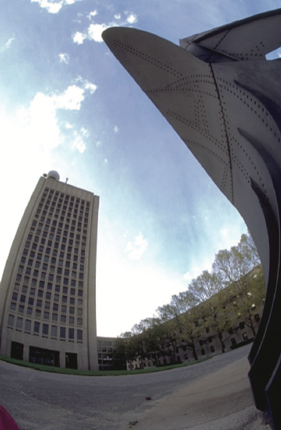
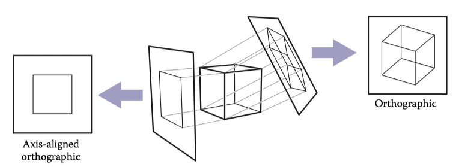
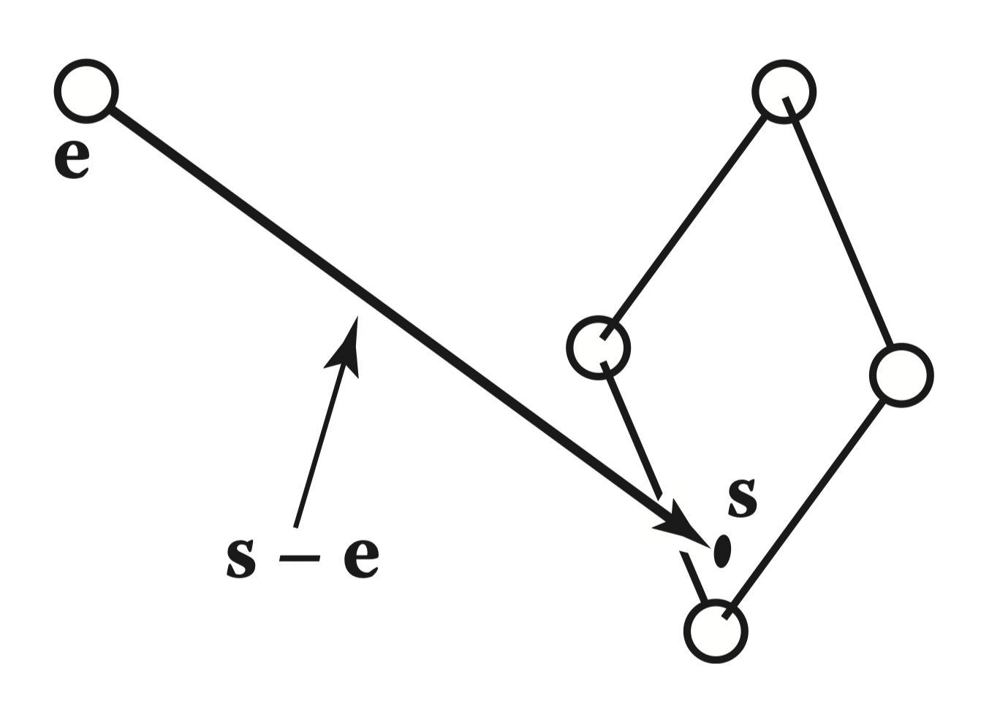

# 4 Ray Tracing

One of the basic tasks of computer graphics is rendering three-dimensional objects: taking a scene, or model, composed of many geometric objects arranged in 3D space and producing a 2D image that shows the objects as viewed from a particular viewpoint. It is the same operation that has been done for centuries by architects and engineers creating drawings to communicate their designs to others.

Fundamentally, rendering is a process that takes as its input a set of objects and produces as its output an array of pixels. One way or another, rendering involves considering how each object contributes to each pixel; it can be organized in two general ways. In object-order rendering, each object is considered in turn, and for each object all the pixels that it influences are found and updated. In image-order rendering, each pixel is considered in turn, and for each pixel all the objects that influence it are found and the pixel value is computed. You can think of the difference in terms of the nesting of loops: in image-order rendering the “for each pixel” loop is on the outside, whereas in object-order rendering the “for each object” loop is on the outside.

Image-order and object-order rendering approaches can compute exactly the same images, but they lend themselves to computing different kinds of effects and have quite different performance characteristics. We’ll explore the comparative strengths of the approaches in Chapter 8 after we have discussed them both, but, broadly speaking, image-order rendering is simpler to get working and more flexible in the effects that can be produced, and usually (though not always) takes much more execution time to produce a comparable image.

Ray tracing is an image-order algorithm for making renderings of 3D scenes, and we’ll consider it first because it’s possible to get a ray tracer working without developing any of the mathematical machinery that’s used for object-order rendering.

## 4.1 The Basic Ray-Tracing Algorithm

A ray tracer works by computing one pixel at a time, and for each pixel the basic task is to find the object that is seen at that pixel’s position in the image. Each pixel “looks” in a different direction, and any object that is seen by a pixel must intersect the viewing ray, a line that emanates from the viewpoint in the direction that pixel is looking. The particular object we want is the one that intersects the viewing ray nearest the camera, since it blocks the view of any other objects behind it. Once that object is found, a shading computation uses the intersection point, surface normal, and other information (depending on the desired type of rendering) to determine the color of the pixel. This is shown in Figure 4.1, where the ray intersects two triangles, but only the first triangle hit, $T_2$ , is shaded.

::: center

**Figure 4.1.** The ray is “traced” into the scene and the first object hit is the one seen through the pixel. In this case, the triangle $T_2$ is returned.
:::

A basic ray tracer therefore has three parts:

1. ray generation, which computes the origin and direction of each pixel’s viewing ray based on the camera geometry;
2. ray intersection, which finds the closest object intersecting the viewing ray;
3. shading, which computes the pixel color based on the results of ray intersection.

The structure of the basic ray tracing program is:

:::
for each pixel do
    compute viewing ray
    find first object hit by ray and its surface normal n
    set pixel color to value computed from hit point, light, and n
:::

This chapter covers basic methods for ray generation, ray intersection, and shading, that are sufficient for implementing a simple demonstration ray tracer. For a really useful system, more efficient ray intersection techniques from Chapter 12 need to be added, and the real potential of a ray tracer will be seen with the more advanced shading methods from Chapter 10 and the additional rendering techniques from Chapter 13.

## 4.2 Perspective

The problem of representing a 3D object or scene with a 2D drawing or painting was studied by artists hundreds of years before computers. Photographs also represent 3D scenes with 2D images. While there are many unconventional ways to make images, from cubist painting to fisheye lenses (Figure 4.2) to peripheral cameras, the standard approach for both art and photography, as well as computer graphics, is linear perspective, in which 3D objects are projected onto an image plane in such a way that straight lines in the scene become straight lines in the image.

::: center

**Figure 4.2.** An image taken with a fisheye lens is not a linear perspective image. Photo courtesy Philip Greenspun.
:::

The simplest type of projection is parallel projection, in which 3D points are mapped to 2D by moving them along a projection direction until they hit the image plane (Figures 4.3–4.4). The view that is produced is determined by the choice of projection direction and image plane. If the image plane is perpendicular to the view direction, the projection is called orthographic; otherwise it is called oblique.

::: center

**Figure 4.3.** When projection lines are parallel and perpendicular to the image plane, the resulting views are called orthographic.
:::

Parallel projections are often used for mechanical and architectural drawings because they keep parallel lines parallel and they preserve the size and shape of planar objects that are parallel to the image plane.

::: center

**Figure 4.4.** A parallel projection that has the image plane at an angle to the projection direction is called oblique (right). In perspective projection, the projection lines all pass through the viewpoint, rather than being parallel (left). The illustrated perspective view is non-oblique because a projection line drawn through the center of the image would be perpendicular to the image plane.
:::

The advantages of parallel projection are also its limitations. In our everyday experience (and even more so in photographs) objects look smaller as they get farther away, and as a result parallel lines receding into the distance do not appear parallel. This is because eyes and cameras don’t collect light from a single viewing direction; they collect light that passes through a particular viewpoint. As has been recognized by artists since the Renaissance, we can produce naturallooking views using perspective projection: we simply project along lines that pass through a single point, the viewpoint, rather than along parallel lines (Figure 4.4). In this way, objects farther from the viewpoint naturally become smaller when they are projected. A perspective view is determined by the choice of viewpoint (rather than projection direction) and image plane. As with parallel views, there are oblique and non-oblique perspective views; the distinction is made based on the projection direction at the center of the image.

::: center

**Figure 4.5.** In three-point perspective, an artist picks “vanishing points” where parallel lines meet. Parallel horizontal lines will meet at a point on the horizon. Every set of parallel lines has its own vanishing points. These rules are followed automatically if we implement perspective based on the correct geometric principles.
:::

You may have learned about the artistic conventions of three-point perspective, a system for manually constructing perspective views (Figure 4.5). A surprising fact about perspective is that all the rules of perspective drawing will be followed automatically if we follow the simple mathematical rule underlying perspective: objects are projected directly toward the eye, and they are drawn where they meet a view plane in front of the eye.

## 4.3 Computing Viewing Rays

From the previous section, the basic tools of ray generation are the viewpoint (or view direction, for parallel views) and the image plane. There are many ways to work out the details of camera geometry; in this section we explain one based on orthonormal bases that supports normal and oblique parallel and orthographic views.

::: center

**Figure 4.6.** The ray from the eye to a point on the image plane.
:::

In order to generate rays, we first need a mathematical representation for a ray. A ray is really just an origin point and a propagation direction; a 3D parametric line is ideal for this. As discussed in Section 2.5.7, the 3D parametric line from the eye e to a point s on the image plane (Figure 4.6) is given by

::: center
p(t) = e +t(s-e)
:::

This should be interpreted as, “we advance from $e$ along the vector $(s-e)$ a fractional distance $t$ to find the point $p$.” So given $t$, we can determine a point $p$. The point $e$ is the ray’s origin, and $(s-e)$ is the ray’s direction.

Note that $p(0) = e$, and $p(1) = s$, and more generally, if $0 < t_1 < t_2$, then $p(t_1)$ is closer to the eye than $p(t_2)$. Also, if $t < 0$, then $p(t)$ is “behind” the eye. These facts will be useful when we search for the closest object hit by the ray that is not behind the eye.

To compute a viewing ray, we need to know $e$ (which is given) and $s$. Finding s may seem difficult, but it is actually straightforward if we look at the problem in the right coordinate system.

::: center

**Figure 4.7.** The sample points on the screen are mapped to a similar array on the 3D window. A viewing ray is sent to each of these locations.
:::

All of our ray-generation methods start from an orthonormal coordinate frame known as the camera frame, which we’ll denote by $e$, for the eye point, or viewpoint, and $u$, $v$, and $w$ for the three basis vectors, organized with $u$ pointing rightward (from the camera’s view), $v$ pointing upward, and $w$ pointing backward, so that ${ u, v, w }$ forms a right-handed coordinate system. The most common way to construct the camera frame is from the viewpoint, which becomes $e$, the view direction, which is $−w$, and the up vector, which is used to construct a basis that has $v$ and $w$ in the plane defined by the view direction and the up direction, using the process for constructing an orthonormal basis from two vectors described in Section 2.4.7.

::: center

**Figure 4.8.** The vectors of the camera frame, together with the view direction and up direction. The $w$ vector is opposite the view direction, and the $v$ vector is coplanar with $w$ and the up vector.
:::

### 4.3.1 Orthographic Views

For an orthographic view, all the rays will have the direction $−w$. Even though a parallel view doesn’t have a viewpoint per se, we can still use the origin of the camera frame to define the plane where the rays start, so that it’s possible for objects to be behind the camera.

The viewing rays should start on the plane defined by the point $e$ and the vectors $u$ and $v$; the only remaining information required is where on the plane the image is supposed to be. We’ll define the image dimensions with four numbers, for the four sides of the image: $l$ and $r$ are the positions of the left and right edges of the image, as measured from $e$ along the $u$ direction; and $b$ and $t$ are the positions of the bottom and top edges of the image, as measured from $e$ along the $v$ direction. Usually $l < 0 < r$ and $b < 0 < t$. (See Figure 4.9.)

In Section 3.2 we discussed pixel coordinates in an image. To fit an image with $n_x \times n_y$ pixels into a rectangle of size $(r−l) \times (t−b)$, the pixels are spaced a distance $(r−l)/n_x$ apart horizontally and $(t−b)/n_y$ apart vertically, with a half-pixel space around the edge to center the pixel grid within the image rectangle. This means that the pixel at position $(i, j)$ in the raster image has the position

$$
u = l + (r-l)(i+0.5)/n_x \\
v = b + (t-b)(j+0.5)/n_y \tag{4.1}
$$

where $(u, v)$ are the coordinates of the pixel’s position on the image plane, measured with respect to the origin e and the basis ${ u, v }$.

In an orthographic view, we can simply use the pixel’s image-plane position as the ray’s starting point, and we already know the ray’s direction is the view direction. The procedure for generating orthographic viewing rays is then:

:::center
compute $u$ and $v$ using (4.1)
ray.direction $\leftarrow$ $−w$
ray.origin $\leftarrow$ $e + u u + v v$
:::

It’s very simple to make an oblique parallel view: just allow the image plane normal $w$ to be specified separately from the view direction $d$. The procedure is then exactly the same, but with $d$ substituted for $−w$. Of course $w$ is still used to construct $u$ and $v$.

### 4.3.2 Perspective Views

For a perspective view, all the rays have the same origin, at the viewpoint; it is the directions that are different for each pixel. The image plane is no longer positioned at $e$, but rather some distance $d$ in front of $e$; this distance is the image plane distance, often loosely called the focal length, because choosing $d$ plays the same role as choosing focal length in a real camera. The direction of each ray is defined by the viewpoint and the position of the pixel on the image plane. This situation is illustrated in Figure 4.9, and the resulting procedure is similar to the orthographic one:

::: center
compute $u$ and $v$ using (4.1)
ray.direction $\leftarrow$ $−d w + u u + v v$
ray.origin $\leftarrow e$
:::

As with parallel projection, oblique perspective views can be achieved by specifying the image plane normal separately from the projection direction, then replacing $−d$ w with dd in the expression for the ray direction.

## 4.4 Ray-Object Intersection

Once we’ve generated a ray $e+td$, we next need to find the first intersection with any object where $t > 0$. In practice, it turns out to be useful to solve a slightly more general problem: find the first intersection between the ray and a surface that occurs at a $t$ in the interval $[t_0 , t_1]$. The basic ray intersection is the case where $t_0 = 0$ and $t_1 = +\infty$. We solve this problem for both spheres and triangles. In the next section, multiple objects are discussed.

Given a ray $p(t) = e + td$ and an implicit surface $f(p) = 0$ (see Section 2.5.3), we’d like to know where they intersect. Intersection points occur when points on the ray satisfy the implicit equation, so the values of $t$ we seek are those that solve the equation

::: center
$f(p(t)) = 0$ or $f(e + td) = 0$
:::

A sphere with center $c = (x_c, y_c, z_c)$ and radius $R$ can be represented by the implicit equation

We can write this same equation in vector form:

::: center
(p − c) · (p − c) − R 2 = 0.
:::

### 4.4.1 Ray-Sphere Intersection

## 4.5 Shading

## 4.6 A Ray-Tracing Program

## 4.7 Shadows

## 4.8 Ideal Specular Reflection

It is straightforward to add ideal specular reflection, or mirror reflection, to a raytracing program. The key observation is shown in Figure 4.19 where a viewer looking from direction $e$ sees what is in direction $r$ as seen from the surface. The vector $r$ is found using a variant of the Phong lighting reflection Equation (10.6). There are sign changes because the vector $d$ points toward the surface in this case, so,

$$
r = d − 2(d · n)n \tag{4.5}
$$

In the real world, some energy is lost when the light reflects from the surface, and this loss can be different for different colors. For example, gold reflects yellow more efficiently than blue, so it shifts the colors of the objects it reflects. This can be implemented by adding a recursive call in raycolor:

::: center
color $c$ = $c + k_m$ raycolor($p + sr$, $\in$, $\infty$)
:::

## 4.9 Historical Notes

Ray tracing was developed early in the history of computer graphics (Appel, 1968) but was not used much until sufficient compute power was available (Kay & Greenberg, 1979; Whitted, 1980).

Ray tracing has a lower asymptotic time complexity than basic object-order rendering (Snyder & Barr, 1987; Muuss, 1995; S. Parker et al., 1999; Wald, Slusallek, Benthin, & Wagner, 2001). Although it was traditionally thought of as an offline method, real-time ray tracing implementations are becoming more and more common.

## Frequently Asked Questions

- Why is there no perspective matrix in ray tracing?

The perspective matrix in a z-buffer exists so that we can turn the perspective projection into a parallel projection. This is not needed in ray tracing, because it is easy to do the perspective projection implicitly by fanning the rays out from the eye.

- Can ray tracing be made interactive?

For sufficiently small models and images, any modern PC is sufficiently powerful for ray tracing to be interactive. In practice, multiple CPUs with a shared frame buffer are required for a full-screen implementation. Computer power is increasing much faster than screen resolution, and it is just a matter of time before conventional PCs can ray trace complex scenes at screen resolution.

- Is ray tracing useful in a hardware graphics program?

Ray tracing is frequently used for picking. When the user clicks the mouse on a pixel in a 3D graphics program, the program needs to determine which object is visible within that pixel. Ray tracing is an ideal way to determine that.

## Exercises

1. What are the ray parameters of the intersection points between ray $(1, 1, 1) + t(−1, −1, −1)$ and the sphere centered at the origin with radius 1? Note: this is a good debugging case.
2. What are the barycentric coordinates and ray parameter where the ray $(1, 1, 1) + t(−1, −1, −1)$ hits the triangle with vertices $(1, 0, 0)$, $(0, 1, 0)$, and $(0, 0, 1)$? Note: this is a good debugging case.
3. Do a back of the envelope computation of the approximate time complexity of ray tracing on “nice” (non-adversarial) models. Split your analysis into the cases of preprocessing and computing the image, so that you can predict the behavior of ray tracing multiple frames for a static model.